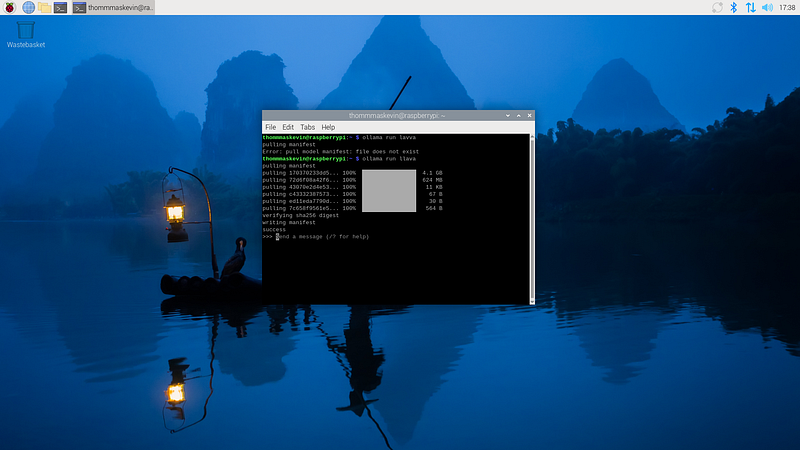

# EdgeAI - LLaVA on Raspberry Pi 5 (Multimodal Model)

_From mathematical foundations to edge implementation_

**Social media:**

👨🏽‍💻 Github: [thommaskevin/TinyML](https://github.com/thommaskevin/TinyML)

👷🏾 Linkedin: [Thommas Kevin](https://www.linkedin.com/in/thommas-kevin-ab9810166/)

📽 Youtube: [Thommas Kevin](https://www.youtube.com/channel/UC7uazGXaMIE6MNkHg4ll9oA)

:pencil2:CV Lattes CNPq: [Thommas Kevin Sales Flores](http://lattes.cnpq.br/0630479458408181)

👨🏻‍🏫 Research group: [Conecta.ai](https://conect2ai.dca.ufrn.br/)


## SUMMARY

1 — Introduction

2 — LLaVA: Large Language and Vision Assistant

2.1 — Architecture

2.2 — Training

3 — EdgeAI Implementation

---

## 1 - Introduction

The rapid advancements in artificial intelligence (AI) have significantly enhanced the ability of machines to process and understand data. Traditionally, AI models were designed to handle a single type of input, such as text, images, or audio. However, real-world scenarios often involve a complex interplay of multiple data modalities. For instance, understanding a scene in a video may require analyzing visual frames, interpreting accompanying audio, and even reading embedded textual information. Addressing this challenge, multimodal models have emerged as a groundbreaking paradigm that integrates diverse types of data into a cohesive analytical framework.


Multimodal models aim to bridge the gap between disparate data sources by learning shared representations that enable cross-modal reasoning and decision-making. These models leverage cutting-edge architectures, such as transformers, to combine inputs from modalities like vision, language, and sound, creating systems that can perceive and act in a more human-like manner. Prominent examples include systems capable of generating descriptive captions for images, answering questions about videos, or synthesizing content across text and visuals.


## 2 - LLaVA: Large Language and Vision Assistant

LLaVA-Phi is a highly efficient multi-modal assistant that combines the strengths of a compact language model, Phi-2, with advanced visual capabilities to engage in multi-modal dialogues. Despite having only 2.7 billion parameters, LLaVA-Phi is capable of handling complex tasks involving both text and images, such as visual reasoning and question-answering.

The model's architecture is optimized to process and understand visual content, making it well-suited for environments where quick, real-time interactions are required. LLaVA-Phi demonstrates strong performance on benchmarks designed for multi-modal tasks, often outperforming larger models in visual comprehension and knowledge-based reasoning tasks. This efficiency and performance open up new possibilities for its application in resource-constrained environments, such as embodied agents and other systems requiring rapid decision-making.

### 2.1 - Architecture

The primary goal is to effectively leverage the capabilities of both the pre-trained LLM and visual model. The network archtecture is illustrated in Figure 2. We choose Vicuna as our LLM fϕ(·) parameterized by ϕ, as it has the best instruction following capabilities in language tasks among publicly available checkpoints.


For an input image \(X_v\), we consider the pre-trained CLIP visual encoder ViT-L/14, which provides the visual feature \(Z_v = g(X_v)\). The grid features before and after the last Transformer layer are considered in our experiments. We consider a simple linear layer to connect image features into the word embedding space. Specifically, we apply a trainable projection matrix \(W\) to convert \(Z_v\) into language embedding tokens \(H_v\), which have the same dimensionality as the word embedding space in the language model:  

$$
H_v = W \cdot Z_v, \text{ with } Z_v = g(X_v)
$$


Thus, we have a sequence of visual tokens Hv. Note that our simple projection scheme is lightweight, which allows us to iterate data centric experiments quickly. More sophisticated schemes to connect the image and language representations can also be considered, such as gated cross-attention in Flamingo and Q-former in BLIP-2. We leave exploring possibly more effective and sophisticated architecture designs for LLaVA as future work.


### 2.2 - Training

For each image \(X_v\), we generate multi-turn conversation data \((X_q^1, X_a^1, \cdots, X_q^T, X_a^T)\), where \(T\) is the total number of turns. We organize them as a sequence by treating all answers as the assistant’s response, and the instruction \(X_{\text{instruct}}^t\) at the \(t\)-th turn as:


$$
X_{\text{instruct}}^t =
\begin{cases} 
\text{Randomly choose } [X_q^1, X_v] \text{ or } [X_v, X_q^1], & \text{the first turn } t = 1 \\ 
X_q^t, & \text{the remaining turns } t > 1
\end{cases}
$$


This leads to the unified format for the multimodal instruction-following sequence illustrated in Figure 3. We perform instruction-tuning of the LLM on the prediction tokens, using its original auto-regressive training objective.


Specifically, for a sequence of length \(L\), we compute the probability of the target answers \(X_a\)


$$
p(X_a \mid X_v, X_{\text{instruct}}) = \prod_{i=1}^L p_\theta(x_i \mid X_v, X_{\text{instruct}}, <i, X_{a,<i})
$$


where θ is the trainable parameters, Xinstruct, for better readability. For LLaVA model training, we consider a two-stage instruction-tuning procedure.

- **Stage 1: Pre-training for Feature Alignment**

To strike a balance between concept coverage and training efficiency, we filter CC3M to 595K image-text pairs. These pairs are converted to the instruction-following data using the naive expansion method describe in Section 3. Each sample can be treated as a single-turn conversation. To construct the input Xinstruct in (2), for an image Xv, a question Xq is randomly sampled, which is a language instruction to request the assistant to describe the image briefly. The ground-truth prediction answer Xa is the original caption. In training, we keep both the visual encoder and LLM weights frozen, and maximize the likelihood of (3) with trainable parameters θ = W (the projection matrix) only. In this way, the image features Hv can be aligned with the pre-trained LLM word embedding. This stage can be understood as training a compatible visual tokenizer for the frozen LLM.


- **Stage 2: Fine-tuning End-to-End**


We always keep the visual encoder weights frozen, and continue to update both the pre-trained weights of the projection layer and LLM in LLaVA; i.e., the trainable parameters are θ = {W, ϕ}. We consider two specific use case scenarios: 


**Multimodal Chatbot:** We develop a Chatbot by fine-tuning on the 158K language-image instruction-following data. Among the three types of responses, conversation is multi-turn while the other two are single-turn. They are uniformly sampled in training. 


**Science QA:**  We study our method on the ScienceQA benchmark, the first large-scale multimodal science question dataset that annotates the answers with detailed lectures and explanations. Each question is provided a context in the form of natural language or an image. The assistant provides the reasoning process in natural language and selects the answer among multiple choices. For training, we organize the data as a single turn conversation, the question & context as Xinstruct, and reasoning & answer as $X_a$.


## 3 - EdgeAI Implementation

With this example you can implement the machine learning algorithm in Raspberry Pi 5.

### 3.0 - Gather the necessary materials

- Raspberry Pi 5 (with a compatible power cable)

- MicroSD card (minimum 64 GB, 126 GB or higher recommended)

- Computer with an SD card reader or USB adapter

- HDMI cable and a monitor/TV

- USB keyboard and mouse (or Bluetooth if supported)

- Internet connection (via Wi-Fi or Ethernet cable)


### 3.1 - Download and install the operating system


Visit [here](https://medium.com/@thommaskevin/edgeai-llama-on-raspberry-pi-4-4dffd65d33ab) to do how download and install the operating system in Raspberry pi 4 or 5.


### 3.2 - Install Ollama

```bash
curl -fsSL https://ollama.com/install.sh | sh
```


### 3.3 - Run llava

```bash
ollama run llava
```





### 3.4 - Results for text question

The question: What is the cristo redentor in Brazil


### 3.5 - Results for image and text question


Let's download the image from the internet, for example (Wikipedia: [Cristo Redentor - Wikipedia](https://medium.com/@thommaskevin/edgeai-llama-on-raspberry-pi-4-4dffd65d33ab)):


Let's enter with this prompt: describe the image in /home/thommaskevin/Pictures/cristo.jpg


**References:**

- https://llava-vl.github.io/

- https://github.com/Seeed-Projects/Tutorial-of-AI-Kit-with-Raspberry-Pi-From-Zero-to-Hero/tree/main?tab=readme-ov-file
