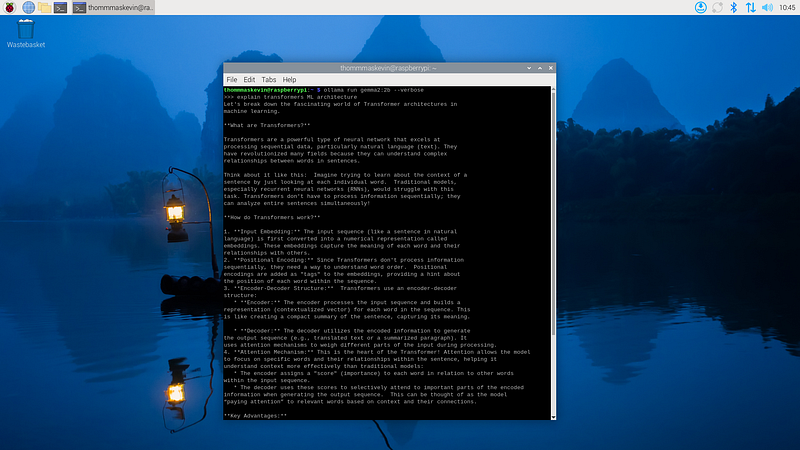

# EdgeAI - Gemma 2 on Raspberry Pi 5

_From mathematical foundations to edge implementation_

**Social media:**

👨🏽‍💻 Github: [thommaskevin/TinyML](https://github.com/thommaskevin/TinyML)

👷🏾 Linkedin: [Thommas Kevin](https://www.linkedin.com/in/thommas-kevin-ab9810166/)

📽 Youtube: [Thommas Kevin](https://www.youtube.com/channel/UC7uazGXaMIE6MNkHg4ll9oA)

:pencil2:CV Lattes CNPq: [Thommas Kevin Sales Flores](http://lattes.cnpq.br/0630479458408181)

👨🏻‍🏫 Research group: [Conecta.ai](https://conect2ai.dca.ufrn.br/)


## SUMMARY

1 — Introduction

2 — GEMMA 2: Generalized Ensemble Machine Model Algorithm

2.1 — Model Architecture

2.2 — Pre-training

2.3 — Post-Training

3 — EdgeAI Implementation

---

## 1 - Introduction

GEMMA 2 (Generalized Ensemble Machine Model Algorithm, Version 2) is a sophisticated framework designed for scalable and flexible machine learning model training, particularly in distributed and resource-constrained environments. Building upon its predecessor, GEMMA 2 introduces enhanced capabilities for both supervised and unsupervised learning tasks, making it a powerful tool for researchers and practitioners in fields such as artificial intelligence, edge computing, and data science.

The core of GEMMA 2 is its ability to handle diverse datasets and model architectures while optimizing computational efficiency. This is achieved through innovations in algorithmic design, including support for adaptive clustering, multi-resolution data analysis, and quantization techniques that ensure compatibility with resource-limited devices like microcontrollers and embedded systems.
Key features of GEMMA 2 include:

- **Distributed Learning:** Leveraging parallel computation to enable faster training and evaluation across multiple nodes.

- **Model Compression:** Employing advanced quantization and pruning strategies to reduce model size without compromising accuracy.

- **Edge Deployment:** Tailored optimizations for deploying machine learning models on edge devices, ensuring real-time performance with minimal energy consumption.

- **Enhanced Flexibility:** Support for a wide range of machine learning paradigms, including neural networks, decision trees, and ensemble methods.

- **User-Centric Design:** A modular architecture with user-friendly APIs, simplifying integration and customization for specific use cases.


## 2 - Gemma 2

The Gemma 2 models are based on a decoder-only transformer architecture. We summarize the main parameters andarchitecture choices in Table.


A few architectural elements are similar to the first version of Gemma models; namely, a context length of 8192 tokens, the use of Rotary Position Embeddings (RoPE), and the approximated GeGLU non-linearity. A few elements differ between Gemma 1 and Gemma 2, including using deeper networks. We summarize the key differences below.


### 2.1 - Model Architecture

#### 2.1.1 - Local Sliding Window and Global Attention

We alternate between a local sliding window attention and global attention in every other layer. The sliding window size of local attention layers is set to 4096 tokens, while the span of the global attention layers is set to 8192 tokens.

#### 2.1.2 - Logit soft-capping

We cap logits  in each attention layer and the final layer such that the value of the logits stays between −soft_cap and +soft_cap. More specifically, we cap the logits with the following function:


We set the soft_cap parameter to 50.0 for the self-attention layers and to 30.0 for the final layer.


#### 2.1.3 - Post-norm and pre-norm with RMSNorm

To stabilize training, we use RMSNorm to normalize the input and output of each transformer sub-layer, the attention layer, and the feedforward layer.

#### 2.1.4 - Grouped-Query Attention


This technique helps the model process information more efficiently, especially when dealing with large amounts of text. It improves upon traditional multi-head attention (MHA) by grouping queries together, enabling faster processing, especially for large models. It's like dividing a large task into smaller, more manageable chunks, allowing the model to understand the relationships between words faster without sacrificing accuracy.


```python
Gemma2ForCausalLM(
  (model): Gemma2Model(
    (embed_tokens): Embedding(256000, 4608, padding_idx=0)
    (layers): ModuleList(
      (0-45): 46 x Gemma2DecoderLayer(
        (self_attn): Gemma2SdpaAttention(
          (q_proj): Linear(in_features=4608, out_features=4096, bias=False)
          (k_proj): Linear(in_features=4608, out_features=2048, bias=False)
          (v_proj): Linear(in_features=4608, out_features=2048, bias=False)
          (o_proj): Linear(in_features=4096, out_features=4608, bias=False)
          (rotary_emb): Gemma2RotaryEmbedding()
        )
        (mlp): Gemma2MLP(
          (gate_proj): Linear(in_features=4608, out_features=36864, bias=False)
          (up_proj): Linear(in_features=4608, out_features=36864, bias=False)
          (down_proj): Linear(in_features=36864, out_features=4608, bias=False)
          (act_fn): PytorchGELUTanh()
        )
        (input_layernorm): Gemma2RMSNorm()
        (post_attention_layernorm): Gemma2RMSNorm()
        (pre_feedforward_layernorm): Gemma2RMSNorm()
        (post_feedforward_layernorm): Gemma2RMSNorm()
      )
    )
    (norm): Gemma2RMSNorm()
  )
  (lm_head): Linear(in_features=4608, out_features=256000, bias=False)
)
```


### 2.2 - Pre-training

A brief overview of the parts of our pre-training that differs from Gemma 1.

#### 2.2.1 - Training Data

Gemma 2 27B on 13 trillion tokens of primarily-English data, the 9B model on 8 trillion tokens, and the 2B on 2 trillion tokens. These tokens come from a variety of data sources, including web documents, code, and science articles. Our models are not multimodal and are not trained specifically for state-of-the-art multilingual capabilities. The final data mixture was determined through ablations similar to the approach in Gemini 1.0.


- **Tokenizer:** use the same tokenizer as Gemma 1 and Gemini: a SentencePiece tokenizer with split digits, preserved whitespace, and byte-level encodings. The resulting vocabulary has 256k entries.


- **Filtering:** use the same data filtering techniques as Gemma 1. Specifically, we filter the pre-training dataset to reduce the risk of unwanted or unsafe utterances, filter out certain personal information or other sensitive data, decontaminate evaluation sets from our pre-training data mixture, and reduce the risk of recitation by minimizing the proliferation of sensitive outputs.


#### 2.2.2 - Knowledge Distillation

Given a large model used as a teacher, we learn smaller models by distilling from the probability given by the teacher of each token 𝑥 given its context 𝑥𝑐 , i.e., 𝑃𝑇 (𝑥 | 𝑥𝑐). More precisely, we minimize the negative log-likelihood between the probabilities from the teacher and the student:


where 𝑃𝑆 is the parameterized probability of the student. Note that knowledge distillation was also used in Gemini 1.5.


### 2.3 - Post-Training

For post-training, we fine-tune our pre-trained models into instruction-tuned models. First, we apply supervised fine-tuning (SFT) on a mix of text-only, English-only synthetic and human generated prompt-response pairs. We then apply RLHF on top of these models with the reward model trained on labelled English-only preference data and the policy based on the same prompts as the SFT phase. Finally, we average the models obtained after each phase to improve their overall performance. The final data mixtures and post-training recipe, which includes tuned hyper-parameters, were chosen on the basis of improving helpfulness while minimizing model harms related to safety and hallucinations.


We extended the post-training data from Gemma 1.1 with a mixture of internal and external public data. In particular, we use the prompts, but not the answers from LMSYS-chat-1M. All of our data go through a filtering stage described below.


- **Supervised fine-tuning (SFT):** We run behavioral cloning on synthetic and real prompts, and responses predominantly synthetically generated by the teacher, that is a larger model. We also run distillation from the teacher on the student's distribution.


- **Reinforcement Learning from Human Feedback (RLHF):** We use a similar RLHF algorithm as Gemma 1.1 but a different reward model, which is an order of larger than the policy. The new reward model is also oriented more towards conversational capabilities, specifically multi-turn.

- **Model merging: We average different models obtained by running our pipeline with different hyperparameters.


- **Data filtering:** When using synthetic data, we run several stages of filtering to remove examples that show certain personal information, unsafe or toxic model outputs, mistaken self-identification data, and duplicated examples. Following Gemini, we find that including subsets of data that encourage better in-context attribution, hedging, and refusals to minimize hallucinations improves performance on factuality metrics, without degrading model performance on another metric.

- **Formatting:** Gemma 2 models are fine-tuned with the same control tokens as Gemma 1 models, but a different formatting schema. Notice that the model explicitly ends generations with tokens, while previously it only generated. For the motivation behind this formatting structure, see Gemma 1.


## 3 - EdgeAI Implementation

With this example you can implement the machine learning algorithm in Raspberry Pi 5.

### 3.0 - Gather the necessary materials

- Raspberry Pi 5 (with a compatible power cable)

- MicroSD card (minimum 64 GB, 126 GB or higher recommended)

- Computer with an SD card reader or USB adapter

- HDMI cable and a monitor/TV

- USB keyboard and mouse (or Bluetooth if supported)

- Internet connection (via Wi-Fi or Ethernet cable)


### 3.1 - Download and install the operating system


Visit [here](https://medium.com/@thommaskevin/edgeai-llama-on-raspberry-pi-4-4dffd65d33ab) to do how download and install the operating system in Raspberry pi 4 or 5.


### 3.2 - Install Ollama

```bash
curl -fsSL https://ollama.com/install.sh | sh
```


### 3.3 - Run gemma2

```bash
ollama run gemma2:2b --verbose
```


### 3.4 - Results for question

The question: Explain transformers ML architecture





**References:**

- https://developers.googleblog.com/en/gemma-explained-new-in-gemma-2/

- https://storage.googleapis.com/deepmind-media/gemma/gemma-2-report.pdf

- https://github.com/Seeed-Projects/Tutorial-of-AI-Kit-with-Raspberry-Pi-From-Zero-to-Hero/tree/main?tab=readme-ov-file
