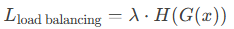
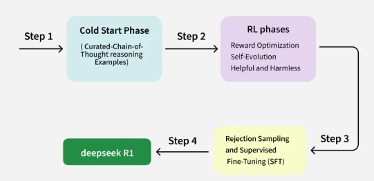
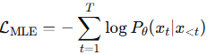

# EdgeAI - DeepSeek-R1 on Raspberry Pi

_From mathematical foundations to edge implementation_

**Social media:**

👨🏽‍💻 Github: [thommaskevin/TinyML](https://github.com/thommaskevin/TinyML)

👷🏾 Linkedin: [Thommas Kevin](https://www.linkedin.com/in/thommas-kevin-ab9810166/)

📽 Youtube: [Thommas Kevin](https://www.youtube.com/channel/UC7uazGXaMIE6MNkHg4ll9oA)

:pencil2:CV Lattes CNPq: [Thommas Kevin Sales Flores](http://lattes.cnpq.br/0630479458408181)

👨🏻‍🏫 Research group: [Conecta.ai](https://conect2ai.dca.ufrn.br/)


## SUMMARY

1 — Introduction

2 — DeepSeek-R1

2.1 — Model Architecture

2.2 — Training Methodology

3 — EdgeAI Implementation

---

## 1 - Introduction

eepSeek-R1 is an open-source reasoning model developed by the Chinese AI company DeepSeek. Released on January 20, 2025, it is designed to excel in tasks requiring logical inference, mathematical problem-solving, and real-time decision-making. Notably, DeepSeek-R1's performance is on par with OpenAI's o1 model, positioning it as a significant advancement in artificial intelligence.

The development of DeepSeek-R1 involved a unique training methodology. The initial version, DeepSeek-R1-Zero, was trained exclusively using large-scale reinforcement learning without supervised fine-tuning. This approach led to the emergence of powerful reasoning behaviors. Building upon this, DeepSeek-R1 was further refined to improve readability and language consistency, resulting in a model capable of sophisticated reasoning tasks.

DeepSeek has also released distilled versions of the R1 model, which are smaller and more efficient, making them suitable for a wider range of applications. These distilled models maintain performance comparable to larger models while offering increased accessibility.

The release of DeepSeek-R1 has had a significant impact on the AI industry, leading to a substantial sell-off in tech stocks and prompting discussions about the global AI landscape. Its open-source nature and high performance have challenged existing models, highlighting China's rapid advancements in artificial intelligence.

## 2 - DeepSeek-R1

At the core of DeepSeek-R1 is the Mixture of Experts architecture, which consists of multiple specialized sub-models, or experts, that handle different aspects of input data. Unlike traditional deep learning models that apply a single network to all inputs, MoE dynamically selects a subset of experts to process each input, significantly improving efficiency and performance.


### 2.1 - Model Architecture

#### 2.1.1 - Mixture of Experts (MoE)
The expert layer in DeepSeek consists of a set of independent neural networks, where a Router Network determines, which experts are activated to process each input token. Formally, the output of the Mixture of Experts (MoE) can be defined as:


Where:
- $N$ is the total number of experts;

- $G_i​(x)$ represents the weight assigned by the router to the $i-th$ expert for the input $x$, with the constraint that: 

- $E_i​(x)$ is the output of the $i-th$ expert.


In DeepSeek, only two experts are activated for each token, significantly reducing the number of active parameters during inference. For instance, if the model has a total of 236 billion parameters, only 21 billion are utilized at each inference step. This mechanism saves memory and accelerates processing without compromising the model's expressiveness.

The routing function $G(x)$ is typically learned using a softmax function:


Where:

- $W_r$​ is the weight matrix of the router.

During training, a load balancing penalty is often added to ensure that the workload is evenly distributed among the experts. This is achieved by incorporating a regularized cross-entropy loss:




Where:

- $H(G(x))$ is the entropy of the router's probabilities;

- $λ$ is a regularization hyperparameter.

This approach ensures that the experts are utilized efficiently, maintaining a balance between computational efficiency and model performance.


#### 2.1.2 - Multi-Head Latent Attention

After passing through the Mixture of Experts (MoE), the model employs a multi-head latent attention mechanism to process long sequences. Latent attention enables compact representation of token interactions by utilizing a KV Cache and vector compression. The attention mechanism follows the classical Self-Attention formulation:


Where:

- $Q, K, V$ are the query, key, and value tensors, respectively;

- $d_k$​ is the dimensionality of the keys.

The KV Cache stores the $(K,V)$ pairs of previous tokens to avoid recomputation, significantly improving efficiency during sequence processing.

DeepSeek introduces a latent vector compression mechanism, which reduces the dimensionality of the stored vectors, enabling efficient handling of sequences of up to 128,000 tokens. This compression can be modeled as:


Where:
- $f(⋅)$ can be a linear projection $Wc​V$, with $Wc$​ being a dimensionality reduction matrix, or

- $f(⋅)$ can be a trained autoencoder designed to minimize the reconstruction error of $V$.

This compression mechanism allows the model to maintain high performance while managing the computational and memory demands of processing extremely long sequences. By reducing the dimensionality of the vectors, DeepSeek achieves a balance between efficiency and the ability to capture complex token interactions.


### 2.2 - Training Methodology

The training process of DeepSeek-R1 consists of four key steps, as illustrated in the diagram. Each phase plays a critical role in refining the model, from initial pretraining to reinforcement learning and fine-tuning. Below, we provide a mathematical description of each stage.




#### 2.2.1 - Cold Start Phase

In the Cold Start Phase, the model undergoes supervised pretraining using a curated dataset, which includes Chain-of-Thought (CoT) reasoning examples. This phase is designed to help the model learn structured reasoning and multi-step problem-solving.


The training objective follows the maximum likelihood estimation (MLE) principle, where the model learns to predict the next token $x_t$​ given the previous tokens $x<t$​:




where:
- $P_θ$​ represents the model's probability distribution parameterized by $θ$;

- $T$ is the sequence length.


The Chain-of-Thought (CoT) method enhances the model's ability to solve complex problems by providing explicit reasoning steps. Instead of training the model to produce direct answers, CoT training includes intermediate reasoning steps in the dataset.

Given an input x, the target output is structured as:


where:
- $y_1​, y_2​, …, y_k$​ represent the intermediate reasoning steps;

- $y_{final}$​ is the final answer.

The training objective follows maximum likelihood estimation (MLE):


By explicitly modeling reasoning steps, CoT enables the model to approximate complex functions more effectively. Instead of approximating a direct mapping:


the model learns a factored decomposition:


where each sub-function $f_θ(i)$​ corresponds to a reasoning step $y_i$​. This structured approach improves generalization to unseen problems.


#### 2.2.2 - Reinforcement Learning

After the initial supervised training, the model enters the Reinforcement Learning (RL) phase to optimize performance based on predefined reward functions. This phase ensures that the model evolves towards more helpful, harmless, and truthful outputs.

The training is guided by the Reinforcement Learning with Human Feedback (RLHF) framework, where the reward function $R(x)$ is used to fine-tune the model's responses.

The model undergoes training using Proximal Policy Optimization (PPO), a popular RL algorithm. The objective function for PPO is:


- The ratio of the new and old policy probabilities is defined by:

;

- $A_t$​ is the advantage function estimating the improvement in expected reward;

- $ϵ$ is a clipping parameter ensuring stable updates.

To further refine the policy, self-evolution is employed, allowing the model to iteratively improve responses through self-distillation techniques:


where $η$ is the learning rate. The model progressively learns from its own outputs and refines its behavior.

To guide the model's learning, a reward function $R(x)$ is used to score outputs. The goal is to maximize the expected reward:


where $D$ represents the dataset of possible responses.


The reward function includes multiple components:

- **Helpfulness:** Encourages informative and relevant responses.
- **Harmlessness:** Penalizes biased or unsafe outputs.
- **Truthfulness:** Ensures factual correctness.

The total reward function can be modeled as:


where $λ_1$​, $λ_2$​, $λ_3$​ are weighting coefficients.


#### 2.2.3 - Rejection Sampling and Supervised Fine-Tuning

After the RL phase, the model undergoes Supervised Fine-Tuning (SFT) using Rejection Sampling. This phase ensures that the model produces high-quality outputs by selecting the best responses from multiple generations.

Rejection Sampling. For a given input $x$, the model generates multiple candidate responses:


A ranking function $R(y)$ assigns a reward score to each candidate:


where $y^*$ is the highest-scoring response. The model is then fine-tuned using supervised learning on the best-ranked outputs.


The loss function for Supervised Fine-Tuning is:


#### 2.2.4 - Conclusion


The training methodology of DeepSeek-R1 integrates:

- Supervised learning with Chain-of-Thought reasoning for structured problem-solving.

- Reinforcement Learning (RLHF) using PPO for optimizing model behavior.

- Rejection Sampling and Fine-Tuning for high-quality response selection.

Mathematically, the model optimizes:

- **MLE loss in pretraining:** $L_{CoT}$​
- **PPO objective in RL:** $L_{PPO}$​
- **Supervised Fine-Tuning loss:** $L_{SFT}$​

These techniques ensure that DeepSeek-R1 is scalable, efficient, and aligned with human intent, making it a state-of-the-art language model.


## 3 - EdgeAI Implementation

With this example you can implement the machine learning algorithm in Raspberry Pi.

### 3.0 - Gather the necessary materials

- Raspberry Pi 5 (with a compatible power cable)

- MicroSD card (minimum 64 GB, 126 GB or higher recommended)

- Computer with an SD card reader or USB adapter

- HDMI cable and a monitor/TV

- USB keyboard and mouse (or Bluetooth if supported)

- Internet connection (via Wi-Fi or Ethernet cable)


### 3.1 - Download and install the operating system


Visit [here](https://medium.com/@thommaskevin/edgeai-llama-on-raspberry-pi-4-4dffd65d33ab) to do how download and install the operating system in Raspberry pi 4 or 5.


### 3.2 - Install Ollama

```bash
curl -fsSL https://ollama.com/install.sh | sh
```


### 3.3 - Run DeepSeek

Link: [deepseek-r1 Models](https://ollama.com/library/deepseek-r1:1.5b)


```bash
ollama run deepseek-r1:{version}
```

We use in this example the 1.5b version

```bash
ollama run deepseek-r1:1.5b
```


### 3.4 - Results for question

The question: explain the LLM models


**References:**

- https://ollama.com/library/deepseek-r1:1.5b

- https://arxiv.org/abs/2501.12948

- https://www.geeksforgeeks.org/deepseek-r1-technical-overview-of-its-architecture-and-innovations/
