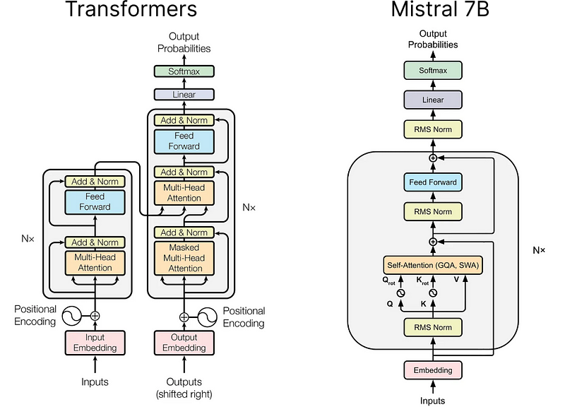

# EdgeAI -Mistral AI _on Raspberry Pi

_From mathematical foundations to edge implementation_

**Social media:**

👨🏽‍💻 Github: [thommaskevin/TinyML](https://github.com/thommaskevin/TinyML)

👷🏾 Linkedin: [Thommas Kevin](https://www.linkedin.com/in/thommas-kevin-ab9810166/)

📽 Youtube: [Thommas Kevin](https://www.youtube.com/channel/UC7uazGXaMIE6MNkHg4ll9oA)

:pencil2:CV Lattes CNPq: [Thommas Kevin Sales Flores](http://lattes.cnpq.br/0630479458408181)

👨🏻‍🏫 Research group: [Conecta.ai](https://conect2ai.dca.ufrn.br/)


## SUMMARY

1 — Introduction

2 — Mistral AI 7B

2.1 — Root Mean Square Normalization

2.2 — Rotary Position Embedding

2.3 — Self-Attention (GQA, SWA)

2.4 — Rolling Buffer Cache

2.5 — Pre-fill and Chunking

3 — EdgeAI Implementation

---

## 1 - Introduction

Mistral 7B is a high-performance, open-weight large language model developed by Mistral AI. Released in September 2023, it features 7.3 billion parameters and is designed for efficiency, speed, and accessibility. Despite its relatively compact size, Mistral 7B outperforms larger models like Llama 2 13B and even challenges Llama 2 34B in various benchmarks.

Built with advanced transformer optimizations, such as grouped-query attention (GQA) and sliding window attention (SWA), Mistral 7B delivers fast inference and improved memory efficiency. As an open-weight model, it provides researchers and developers with full access to its architecture, making it ideal for customization and deployment across diverse AI applications, including text generation, summarization, chatbots, and code completion.

With its blend of power, efficiency, and transparency, Mistral 7B stands as a benchmark for modern open-source AI models, pushing the boundaries of what smaller yet optimized language models can achieve.

## 2 - Mistral AI 7B

Mistral 7B is based on a transformer architecture. In the following sections we will explore these advancements, which include:

- **RMS Normalization**: replacing Layer Normalization;

- **Rotary Position Embedding (RoPE)**: replacing Absolute Positional Encoding;

- **Grouped Query Attention (GQA)**: replacing Multi-Head Attention;

- **Sliding Window Attention (SWA)**: improving training and inference speed, particularly for long sequences;

- **Rolling Buffer KV Cache**: improving training and inference speed, in conjunction with SWA;

- **SwiGLU Activation Function**: replacing ReLU in the Feed Forward sub-layers.



### 2.1 — Root Mean Square Normalization (RMSNorm)

**RMSNorm** is a normalization technique used in transformer architectures like **Mistral 7B**, which differs from **LayerNorm** by normalizing activations based on the **root mean square (RMS)** instead of mean and variance. This approach improves computational efficiency, making it more suitable for large models.  


Given an input $x$ of dimension $d$, RMSNorm is defined as:

$$
\text{RMSNorm}(x) = \gamma \cdot \frac{x}{\text{RMS}(x)}
$$

where:
- $\gamma$ is a trainable parameter that allows the model to adjust the scale of the normalized values.
- $\text{RMS}(x)$ is the normalization factor, computed as:

$$
\text{RMS}(x) = \sqrt{\frac{1}{d} \sum_{i=1}^{d} x_i^2}
$$

Unlike **LayerNorm**, which centers the values by subtracting the mean and then dividing by the standard deviation, **RMSNorm ignores the mean**, reducing computational complexity. This means that, in terms of performance, while LayerNorm requires additional summation and division operations to compute the mean and variance, RMSNorm simply calculates the root mean square and uses it for normalization.


Consider an input vector:

$$
x = [2.0, -3.0, 4.0, -1.0]
$$

First, we compute the RMS:

$$
\text{RMS}(x) = \sqrt{\frac{1}{4} (2^2 + (-3)^2 + 4^2 + (-1)^2)} = \sqrt{\frac{30}{4}} = \sqrt{7.5} \approx 2.74
$$

Next, we normalize the values by dividing each element by the RMS:

$$
\hat{x} = \left[ \frac{2.0}{2.74}, \frac{-3.0}{2.74}, \frac{4.0}{2.74}, \frac{-1.0}{2.74} \right] \approx [0.73, -1.09, 1.46, -0.36]
$$

Finally, we apply the scaling factor $\gamma$. Assuming $\gamma = 1.5$, the final normalized values are:

$$
y = 1.5 \times [0.73, -1.09, 1.46, -0.36] \approx [1.10, -1.64, 2.19, -0.55]
$$


In computational terms, **RMSNorm reduces the complexity of normalization calculations** and saves memory, making it more efficient for models, which handle billions of parameters. However, because it does not center the data, it may slightly alter the learning dynamics compared to LayerNorm. Nonetheless, its impact on convergence has been positive in various **efficiency-optimized transformers**, justifying its adoption.


### 2.2 — Rotary Position Embedding (RoPE)

Rotary Position Embeddings (RoPE) is a technique for encoding **relative positional information** directly into the **self-attention mechanism** of transformer models. Unlike absolute positional encodings (e.g., sinusoidal or learned embeddings), RoPE **preserves distance relationships** between tokens while allowing the model to generalize to longer sequences beyond its training range.


Given a token embedding $ x $ at position $ i $, RoPE applies a **rotation matrix** $ R_i $ to encode its positional information:

$$
\text{RoPE}(x, i) = R_i \cdot x
$$

where:
- $ R_i $ is a **learned or fixed rotation matrix** that encodes position $ i $.
- The transformation is applied **directly to the self-attention queries and keys** before computing attention scores.

Instead of adding positional embeddings like in traditional transformers, RoPE **modifies queries ($ Q $) and keys ($ K $) multiplicatively**.


RoPE is efficiently implemented using complex numbers, where embeddings are treated as pairs of values corresponding to **even and odd indices**:

$$
\text{RoPE}(x, i) = \begin{bmatrix} x_{\text{even}} \\ x_{\text{odd}} \end{bmatrix} \cdot e^{i \theta_i}
$$

where:
- $ e^{i \theta_i} $ is a complex-valued rotation that depends on position $ i $.
- The **angle $ \theta_i $** determines the rotation at each position.

Using a frequency-based positional encoding:

$$
\theta_i = \theta_0^i
$$

where $ \theta_0 $ is a base frequency (e.g., $ \theta_0 = 10000^{-\frac{2j}{d}} $ for dimension $ d $ and index $ j $). A graphic illustration of RoPE is shown in:


This rotation **preserves the relative distances between tokens** while naturally encoding their positions.


RoPE is applied **before computing attention scores**, modifying queries ($ Q $) and keys ($ K $) as follows:

$$
Q'_i = R_i \cdot Q_i, \quad K'_i = R_i \cdot K_i
$$

Then, attention is computed as usual:

$$
\text{Attention}(Q', K', V) = \text{softmax} \left( \frac{Q' K'^T}{\sqrt{d_k}} \right) V
$$

This approach ensures that the **dot product between queries and keys naturally encodes relative positions**, eliminating the need for separate positional embeddings.


Consider two token embeddings:

$$
x_1 = [1.0, 2.0], \quad x_2 = [3.0, 4.0]
$$

Assume a simple **rotation matrix $ R_i $** for position $ i $:

$$
R_i =
\begin{bmatrix}
\cos(\theta_i) & -\sin(\theta_i) \\
\sin(\theta_i) & \cos(\theta_i)
\end{bmatrix}
$$

For positions $ i = 1 $ and $ i = 2 $, using $ \theta_1 = 30^\circ $ and $ \theta_2 = 60^\circ $:

$$
R_1 =
\begin{bmatrix}
0.866 & -0.5 \\
0.5 & 0.866
\end{bmatrix}
$$

$$
R_2 =
\begin{bmatrix}
0.5 & -0.866 \\
0.866 & 0.5
\end{bmatrix}
$$

Applying RoPE:

$$
x_1' = R_1 \cdot x_1 = \begin{bmatrix} 0.866 \cdot 1 - 0.5 \cdot 2 \\ 0.5 \cdot 1 + 0.866 \cdot 2 \end{bmatrix} = \begin{bmatrix} -0.134 \\ 2.232 \end{bmatrix}
$$

$$
x_2' = R_2 \cdot x_2 = \begin{bmatrix} 0.5 \cdot 3 - 0.866 \cdot 4 \\ 0.866 \cdot 3 + 0.5 \cdot 4 \end{bmatrix} = \begin{bmatrix} -1.964 \\ 4.598 \end{bmatrix}
$$

This transformation **preserves the relative positions between tokens**, helping the model understand relationships better.


### 2.3 — Self-Attention (GQA, SWA) 

Self-attention is a key mechanism in transformer architectures to efficiently process and capture relationships between tokens. The **Mistral 7B** model incorporates optimizations such as **Grouped Query Attention (GQA)** and **Sliding Window Attention (SWA)** to improve efficiency and scalability when handling long sequences.


Given an input matrix $X \in \mathbb{R}^{n \times d} $, self-attention computes the output as:

$$
\text{Attention}(Q, K, V) = \text{softmax} \left( \frac{QK^T}{\sqrt{d_k}} \right) V
$$

where:
- $Q = XW_Q $ (queries);
- $K = XW_K $ (keys);
- $V = XW_V $ (values);
- $d_k $ is the dimensionality of each key and query;
- $W_Q, W_K, W_V $ are trainable projection matrices.

Traditional self-attention scales poorly for large sequences due to the **$O(n^2) $** complexity. **GQA** and **SWA** address this issue.


#### 2.3.1 — Grouped Query Attention (GQA)

**GQA** reduces memory usage by decreasing the number of **key-value heads**, which optimizes computational efficiency while maintaining strong model performance. Instead of having independent query, key, and value heads for each attention head, GQA **groups multiple queries to share the same key-value representations**.


Instead of having $h$ independent key-value heads, GQA uses a smaller number $g $, where $g < h $. Each group of query heads shares the same key-value representations:

$$
\text{Attention}_{\text{GQA}}(Q, K, V) = \text{softmax} \left( \frac{Q K_g^T}{\sqrt{d_k}} \right) V_g
$$

where:
- $Q $ has $h $ heads.
- $K_g, V_g $ are **shared across multiple query heads**, reducing memory usage.
- The number of key-value heads $g $ is significantly smaller than $h $.

This results in:
- **Lower memory footprint**, as fewer key-value pairs are stored.
- **Improved efficiency**, especially in large-scale models.


Consider a model with **h = 8 query heads** and **g = 2 key-value heads**. Instead of computing attention for 8 separate key-value sets, the model **groups queries into 2 sets**, effectively reducing computation.

A comparison of MHA, MQA, and GQA is shown in the below. Multi-head attention has H query, key, and value heads. Multi-query attention shares single key and value heads across all query heads. Grouped-query attention instead shares single key and value heads for each group of query heads, interpolating between multi-head and multi-query attention.


#### 2.3.2 — Sliding Window Attention (SWA)

**SWA** improves performance by **restricting attention to a local window**, making it more efficient for long sequences. Instead of attending to all tokens in the sequence, each token attends only to a fixed-sized window of surrounding tokens.


For a token at position $i $, attention is computed only over a window of size $w $:

$$
\text{Attention}_{\text{SWA}}(i) = \text{softmax} \left( \frac{Q_i K_{i-w:i+w}^T}{\sqrt{d_k}} \right) V_{i-w:i+w}
$$

where:
- $w $ defines the window size (e.g., 128 tokens).
- $K_{i-w:i+w} $ and $V_{i-w:i+w} $ are **local key-value pairs** instead of global ones.

This reduces complexity from **$O(n^2) $ to $O(nw) $**, where $w $ is much smaller than $n $.


If a sequence has **n = 1024** tokens and a window size of **w = 128**, each token only computes attention over **256 tokens** (128 on the left, 128 on the right), instead of all **1024 tokens**.

This significantly improves:
- **Speed**, as fewer attention weights need to be computed.
- **Memory efficiency**, since the attention matrix size is reduced.


For exemplo, the number of operations in vanilla attention is quadratic in the sequence length, and the memory increases linearly with the number of tokens. At inference time, this incurs higher latency and smaller throughput due to reduced cache availability. To alleviate this issue, we use sliding window attention: each token can attend to at most W tokens from the previous layer (here, W = 3). Note that tokens outside the sliding window still influence next word prediction. At each attention layer, information can move forward by W tokens. Hence, after k attention layers, information can move forward by up to k × W tokens.


### 2.4 — Rolling Buffer Cache

A fixed attention span means that we can limit our cache size using a rolling buffer cache. The cache has a fixed size of W, and the keys and values for the timestep i are stored in position i mod W of the cache. As a result, when the position i is larger than W, past values in the cache are overwritten, and the size of the cache stops increasing. We provide an illustration in Figure 2 for W = 3. On a sequence length of 32k tokens, this reduces the cache memory usage by 8x, without impacting the model quality.

For exemplo, the cache has a fixed size of W = 4. Keys and values for position i are stored in position i mod W of the cache. When the position i is larger than W, past values in the cache are overwritten. The hidden state corresponding to the latest generated tokens are colored in orange.


### 2.5 — Pre-fill and Chunking

When generating a sequence, we need to predict tokens one-by-one, as each token is conditioned on the previous ones. However, the prompt is known in advance, and we can pre-fill the (k, v) cache with the prompt. If the prompt is very large, we can chunk it into smaller pieces, and pre-fill the cache with each chunk. For this purpose, we can select the window size as our chunk size. For each chunk, we thus need to compute the attention over the cache and over the chunk. Figure in below shows how the attention mask works over both the cache and the chunk.


During pre-fill of the cache, long sequences are chunked to limit memory usage. We process a sequence in three chunks, "The cat sat on", "the mat and saw", "the dog go to". The figure shows what happens for the third chunk ("the dog go to"): it attends itself using a causal mask (rightmost block), attends the cache using a sliding window (center block), and does not attend to past tokens as they are outside of the sliding window (left block).


## 3 - EdgeAI Implementation

With this example you can implement the machine learning algorithm in Raspberry Pi.

### 3.0 - Gather the necessary materials

- Raspberry Pi 5 (with a compatible power cable)

- MicroSD card (minimum 64 GB, 126 GB or higher recommended)

- Computer with an SD card reader or USB adapter

- HDMI cable and a monitor/TV

- USB keyboard and mouse (or Bluetooth if supported)

- Internet connection (via Wi-Fi or Ethernet cable)


### 3.1 - Download and install the operating system


Visit [here](https://medium.com/@thommaskevin/edgeai-llama-on-raspberry-pi-4-4dffd65d33ab) to do how download and install the operating system in Raspberry pi 4 or 5.


### 3.2 - Install Ollama

```bash
curl -fsSL https://ollama.com/install.sh | sh
```


### 3.3 - Run Mistral AI_ 7B

Link: [Mistral AI_ 7B Models](https://ollama.com/library/mistral)


```bash
ollama run mistral
```


### 3.4 - Results for question

The question: explain what is machine learning models


**References:**

- https://arxiv.org/abs/2310.06825

- https://arxiv.org/abs/2104.09864

- https://arxiv.org/abs/2305.13245

- https://medium.com/towards-data-science/mistral-7b-explained-towards-more-efficient-language-models-7f9c6e6b7251
