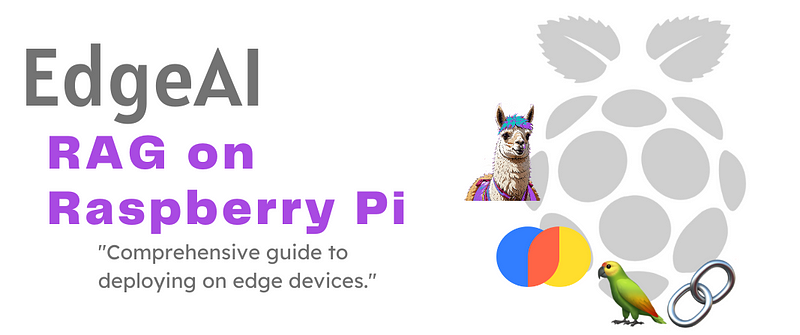
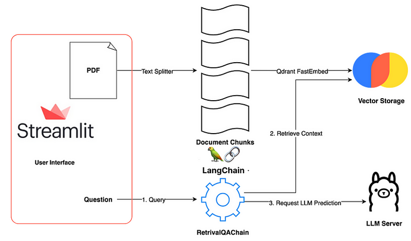
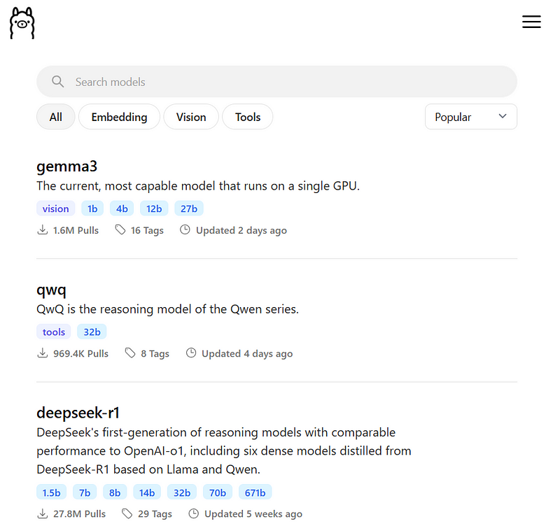

# EdgeAI - Retrieval-Augmented Generation (RAG) on Raspberry Pi

_From mathematical foundations to edge implementation_

**Social media:**

👨🏽‍💻 Github: [thommaskevin/TinyML](https://github.com/thommaskevin/TinyML)

👷🏾 Linkedin: [Thommas Kevin](https://www.linkedin.com/in/thommas-kevin-ab9810166/)

📽 Youtube: [Thommas Kevin](https://www.youtube.com/channel/UC7uazGXaMIE6MNkHg4ll9oA)

:pencil2:CV Lattes CNPq: [Thommas Kevin Sales Flores](http://lattes.cnpq.br/0630479458408181)

👨🏻‍🏫 Research group: [Conecta.ai](https://conect2ai.dca.ufrn.br/)



## SUMMARY

1 — Introduction

2 — RAG Architecture

2.1 — Retriever

2.2 — Generator

2.3 — Joint Training of Retriever and Generator

2.4 — Inference in RAG

2.5 — Extensions and Variants of RAG

3 — EdgeAI Implementation

---

## 1 - Introduction

Text generation using language models has advanced significantly in recent years, driven by architectures such as Transformers and deep learning techniques. Models like GPT-3, BERT, and T5 have demonstrated impressive capabilities in tasks such as machine translation, summarization, and question answering. However, these models face significant challenges, particularly when it comes to ensuring the factual accuracy of responses, accessing up-to-date or specific information not present in their training data, and handling complex contexts that require external knowledge.

These limitations are especially critical in applications where the precision and reliability of information are essential, such as in virtual assistants, decision support systems, and educational tools. Purely generative language models, while capable of producing coherent and fluent text, often generate responses that are factually incorrect or outdated, as they rely solely on the knowledge encoded in their parameters during training.

To overcome these limitations, the concept of Retrieval-Augmented Generation (RAG) has emerged. RAG integrates external information retrieval with text generation, combining the ability of generative models to produce natural text with the capability of retrieval systems to access a vast corpus of up-to-date and relevant documents. This combination allows the system to generate more accurate, contextually appropriate, and factually correct responses while maintaining the fluency and coherence typical of modern language models.

RAG is particularly useful in scenarios where access to dynamic and specific information is crucial. For example, in a question-answering system, RAG can retrieve relevant documents from an updated knowledge base and then generate a precise answer based on those documents. This contrasts with traditional models, which may generate answers based on outdated or incorrect information due to the lack of access to external sources.

Moreover, RAG offers a scalable solution to the problem of incorporating new knowledge into language models. Instead of requiring frequent retraining of the model to include new information, RAG can dynamically access an updated corpus, reducing the computational cost and time needed to keep the model current.
In this article, we explore the theoretical foundations of RAG, detail its architecture and mathematical formulations, and discuss its practical applications. The integration of a document retrieval module with a generative model not only improves the quality of text generation but also opens new possibilities for applying language models to tasks that demand high precision and reliability.


## 2 - RAG Architecture

The Retrieval-Augmented Generation (RAG) architecture is a hybrid framework that combines two core components: a Retriever and a Generator. These components work in tandem to enhance the capabilities of language models by integrating external knowledge retrieval with text generation. Below, we delve deeper into the architecture, its components, and how they interact.


### 2.1 — Retriever

The Retriever is responsible for sourcing relevant information from an external corpus of documents. It acts as a bridge between the query and the knowledge base, ensuring that the Generator has access to the most pertinent information for generating accurate and contextually appropriate responses.

#### 2.1.1 — Dense Retrieval Mechanism

The Retriever is typically implemented using a **dense retrieval model**, such as DPR (Dense Passage Retriever). Unlike traditional sparse retrieval methods (e.g., TF-IDF or BM25), which rely on keyword matching, dense retrieval uses dense vector representations (embeddings) to capture semantic similarities between queries and documents.

Given a query $q$ and a corpus of documents $D = \{d_1, d_2, \dots, d_N\} $, the Retriever computes the similarity between the query and each document using their respective embeddings. The similarity score is calculated as the dot product of the query embedding $\mathbf{q}$ and the document embedding $\mathbf{d}_i$:

$$
\text{score}(q, d_i) = \mathbf{q}^\top \mathbf{d}_i
$$

The top-$k$ documents with the highest similarity scores are retrieved and passed to the Generator.


#### 2.1.2 — Training the Retriever

The Retriever is trained using a contrastive learning objective. Given a query $q$ and a positive document $d^+$ (a document known to be relevant to the query), the model is trained to maximize the similarity between $q$ and $d^+$ while minimizing the similarity between $q$ and negative documents $d^-$. The loss function for training the Retriever is:

$$
\mathcal{L}_{\text{retriever}} = -\log \frac{\exp(\mathbf{q}^\top \mathbf{d}^+)}{\exp(\mathbf{q}^\top \mathbf{d}^+) + \sum_{d^-} \exp(\mathbf{q}^\top \mathbf{d}^-)}
$$

This approach ensures that the Retriever learns to distinguish between relevant and irrelevant documents effectively.


### 2.2 — Generator

The **Generator** is a generative language model that produces text based on the query and the documents retrieved by the Retriever. It leverages the retrieved information to generate responses that are not only fluent but also factually accurate and contextually relevant.


#### 2.2.1 — Autoregressive Text Generation
The Generator is typically implemented as an autoregressive model, such as T5, GPT, or BART. It generates text token by token, conditioning each step on the previously generated tokens, the query, and the retrieved documents. The probability of generating a sequence of tokens $y = (y_1, y_2, \dots, y_T)$ is modeled as:

$$
P(y | q, D) = \prod_{t=1}^T P(y_t | y_{<t}, q, D),
$$

where:
- $y_t$ is the token generated at step $t$,
- $y_{<t}$ represents the tokens generated before step $t$,
- $q$ is the query,
- $D$ is the set of retrieved documents.

#### 2.2.2 — Incorporating Retrieved Documents
The retrieved documents $D = \{d_{i_1}, d_{i_2}, \dots, d_{i_k}\} $ are concatenated with the query $q$ and fed into the Generator as input. This allows the model to condition its output on both the query and the external knowledge contained in the documents. The input to the Generator can be represented as:

$$
\text{input} = [q; d_{i_1}; d_{i_2}; \dots; d_{i_k}],
$$

where $[;]$ denotes concatenation.

#### 2.2.3 — Training the Generator
The Generator is trained using a standard sequence-to-sequence objective. Given a query $q$, retrieved documents $D$, and a target sequence $y$, the model is trained to minimize the negative log-likelihood of the target sequence:

$$
\mathcal{L}_{\text{generator}} = -\sum_{t=1}^T \log P(y_t | y_{<t}, q, D).
$$


### 2.3 — Joint Training of Retriever and Generator


In the RAG framework, the Retriever and Generator are trained jointly to optimize the end-to-end performance of the system. The joint training process involves alternating between updating the parameters of the Retriever and the Generator.

The overall loss function for RAG is a combination of the Retriever loss and the Generator loss:

$$
\mathcal{L}_{\text{RAG}} = \mathcal{L}_{\text{retriever}} + \mathcal{L}_{\text{generator}}.
$$

During training, the Retriever is updated to retrieve documents that maximize the likelihood of generating the correct target sequence, while the Generator is trained to produce accurate and fluent text based on the retrieved documents.

### 2.4 — Inference in RAG

During inference, the RAG model follows a two-step process:
1. **Retrieval**: Given a query $q$, the Retriever retrieves the top-$k$ most relevant documents $D$ from the external corpus.
2. **Generation**: The Generator takes the query $q$ and the retrieved documents $D$ as input and generates the final output $y$.

The RAG framework can be formalized as a probabilistic model that combines document retrieval with text generation. The marginal probability of the response $y$ given the query $q$ is:

$$
P(y | q) = \sum_{d \in D} P(d | q) \cdot P(y | q, d),
$$

where:

- $P(d | q)$ is the probability of retrieving the document $d$ given the query $q$,
- $P(y | q, d)$ is the probability of generating the response $y$ given the query $q$ and the document $d$.

This formulation highlights the interplay between retrieval and generation, where the model integrates information from multiple documents to produce the final output.


### 2.5 — Extensions and Variants of RAG

Several extensions and variants of the RAG architecture have been proposed to enhance its performance and applicability:

- **RAG-Token:** Instead of using the same set of retrieved documents for the entire generation process, RAG-Token dynamically selects different documents for each token generation step.

- **RAG-Sequence:** This variant uses the same set of retrieved documents for the entire sequence generation process, making it computationally more efficient.

- **Multi-Hop RAG:** This extension enables the model to perform multiple retrieval steps, refining the retrieved information iteratively to improve the quality of the generated text.


## 3 - EdgeAI Implementation

With this example you can implement the machine learning algorithm in Raspberry Pi.





### 3.0 - Gather the necessary materials

- Raspberry Pi 5 with 16Gb (with a compatible power cable)

- MicroSD card (minimum 64 GB, 126 GB or higher recommended)

- Computer with an SD card reader or USB adapter

- HDMI cable and a monitor/TV

- USB keyboard and mouse (or Bluetooth if supported)

- Internet connection (via Wi-Fi or Ethernet cable)


### 3.1 - Download and install the operating system


Visit [here](https://medium.com/@thommaskevin/edgeai-llama-on-raspberry-pi-4-4dffd65d33ab) to do how download and install the operating system in Raspberry pi 4 or 5.


### 3.2 - Update the system

```bash
sudo apt update && sudo apt upgrade -y
```

### 3.3 - Creat and Active a Virtual Environment

```bash
python3 -m venv ~/ragvenv
source ~/ragvenv/bin/activate
```

### 3.4 - Install Requirements

```bash
pip install -r requirements.txt
```


### 3.5 - Install Ollama

```bash
curl -fsSL https://ollama.com/install.sh | sh
```


### 3.6 - Chose the Model

Select a model click: [link](https://ollama.com/search)




```bash
ollama pull llama3.2b
```

Replace in this code snippet: 'self.model = OllamaLLM(model='llama3.2:1b', base_url='http://127.0.0.1:11434")'


### 3.7 - RAG Implementation

When working with text processing, especially in Retrieval-Augmented Generation (RAG) and Natural Language Processing (NLP), it's common to split long documents into smaller parts, called chunks, for better retrieval and processing:

- **chunk_size** defines the maximum number of characters in each text chunk (Each chunk will contain at most 1024 characters. If a document has 5000 characters, it will be split into approximately 5 chunks.).

- **chunk_overlap** controls the number of overlapping characters between consecutive chunks. This helps maintain context continuity (The first chunk contains characters 0 to 1024. The second chunk starts from character 924 (1024–100) to 1948. The overlap ensures that important context isn't lost at chunk boundaries.)

Copy the code in below and save as rag.py:

```python
from langchain_community.vectorstores import Chroma
from langchain_ollama import OllamaLLM
from langchain_community.embeddings import FastEmbedEmbeddings
from langchain.schema.output_parser import StrOutputParser
from langchain_community.document_loaders import PyPDFLoader
from langchain.text_splitter import RecursiveCharacterTextSplitter
from langchain.schema.runnable import RunnablePassthrough
from langchain.prompts import PromptTemplate
from langchain_community.vectorstores.utils import filter_complex_metadata

class ChatPDF:
    vector_store = None
    retriever = None
    chain = None

    def __init__(self):
        # Initialize the Ollama model
        self.model = OllamaLLM(model="llama3.2:1b", base_url="http://127.0.0.1:11434")
        # Initialize the text splitter
        self.text_splitter = RecursiveCharacterTextSplitter(chunk_size=1024, chunk_overlap=100)
        # Define the prompt template
        self.prompt = PromptTemplate.from_template(
            """
            <s> [INST] You are an assistant for question-answering tasks. Use the following context to answer the question. 
            If you don't know the answer, simply say you don't know. Use at most three sentences and be concise in your response. [/INST] </s> 
            [INST] Question: {question} 
            Context: {context} 
            Answer: [/INST]
            """
        )

    def ingest(self, pdf_file_path: str):
        try:
            # Load the PDF file
            docs = PyPDFLoader(file_path=pdf_file_path).load()
            # Split the documents into chunks
            chunks = self.text_splitter.split_documents(docs)
            # Filter out complex metadata
            chunks = filter_complex_metadata(chunks)

            # Create a vector store from the chunks
            self.vector_store = Chroma.from_documents(
                documents=chunks,
                embedding=FastEmbedEmbeddings(),
                persist_directory="./chroma_db"  # Optional: Persist the vector store to disk
            )

            # Initialize the retriever
            self.retriever = self.vector_store.as_retriever(
                search_type="similarity_score_threshold",
                search_kwargs={
                    "k": 3,
                    "score_threshold": 0.5,
                },
            )

            # Set up the chain for querying
            self.chain = (
                {"context": self.retriever, "question": RunnablePassthrough()}
                | self.prompt
                | self.model
                | StrOutputParser()
            )
        except Exception as e:
            print(f"Error during ingestion: {e}")

    def ask(self, query: str):
        if not self.chain:
            return "Please, add a PDF document first."

        try:
            return self.chain.invoke(query)
        except Exception as e:
            return f"Error during query processing: {e}"

    def clear(self):
        self.vector_store = None
        self.retriever = None
        self.chain = None
```

### 3.8 - RAG User Interface

Copy the code in below and save as app.py:

```python
import os
import tempfile
import streamlit as st
from streamlit_chat import message
from rag import ChatPDF

st.set_page_config(page_title="ChatPDF")

def display_messages():
    st.subheader("Chat")
    for i, (msg, is_user) in enumerate(st.session_state["messages"]):
        message(msg, is_user=is_user, key=str(i))
    st.session_state["thinking_spinner"] = st.empty()

def process_input():
    if st.session_state["user_input"] and len(st.session_state["user_input"].strip()) > 0:
        user_text = st.session_state["user_input"].strip()
        with st.session_state["thinking_spinner"], st.spinner(f"Thinking"):
            agent_text = st.session_state["assistant"].ask(user_text)

        st.session_state["messages"].append((user_text, True))
        st.session_state["messages"].append((agent_text, False))

def read_and_save_file():
    st.session_state["assistant"].clear()
    st.session_state["messages"] = []
    st.session_state["user_input"] = ""

    for file in st.session_state["file_uploader"]:
        with tempfile.NamedTemporaryFile(delete=False) as tf:
            tf.write(file.getbuffer())
            file_path = tf.name

        with st.session_state["ingestion_spinner"], st.spinner(f"Ingesting {file.name}"):
            st.session_state["assistant"].ingest(file_path)
        os.remove(file_path)

def page():
    if len(st.session_state) == 0:
        st.session_state["messages"] = []
        st.session_state["assistant"] = ChatPDF()

    st.header("ChatPDF on the Edge")

    st.subheader("Upload a document")
    st.file_uploader(
        "Upload document",
        type=["pdf"],
        key="file_uploader",
        on_change=read_and_save_file,
        label_visibility="collapsed",
        accept_multiple_files=True,
    )

    st.session_state["ingestion_spinner"] = st.empty()

    display_messages()
    st.text_input("Message", key="user_input", on_change=process_input)

if __name__ == "__main__":
    page()
```

### 3.8 - Run the application

create a folder with the name of the project and place the files rag.py and app.py in this folder. Navigate to this folder from the prompt (with ragvenv still active) and run:

```bash
streamlit run app.py
```


**References:**

- https://arxiv.org/abs/2310.06825

- https://arxiv.org/abs/2104.09864

- https://arxiv.org/abs/2305.13245

- https://medium.com/towards-data-science/mistral-7b-explained-towards-more-efficient-language-models-7f9c6e6b7251
