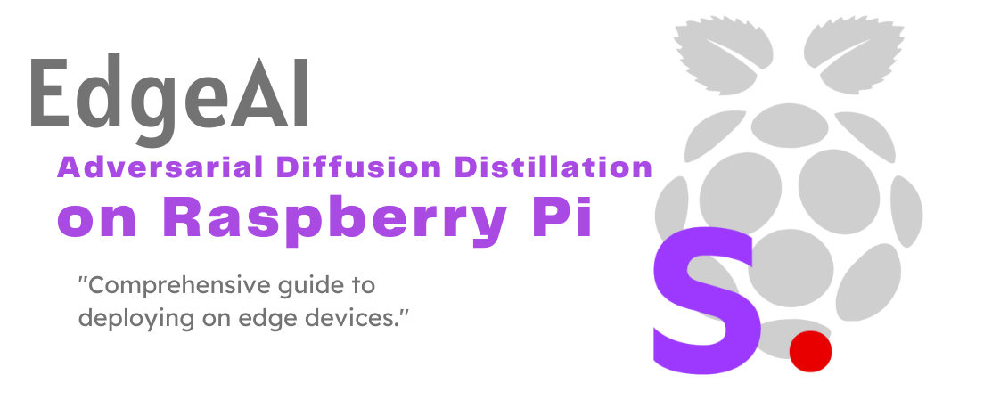
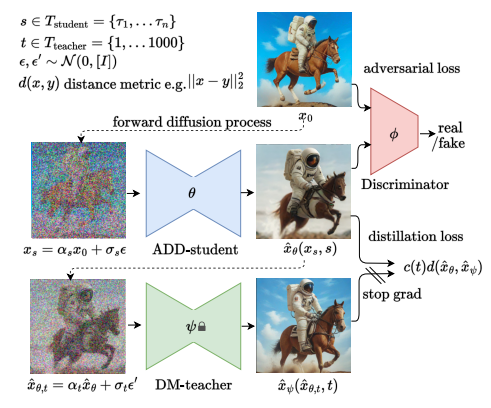
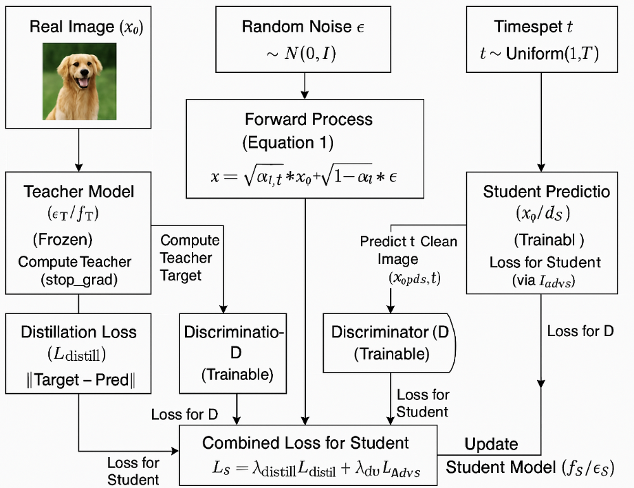
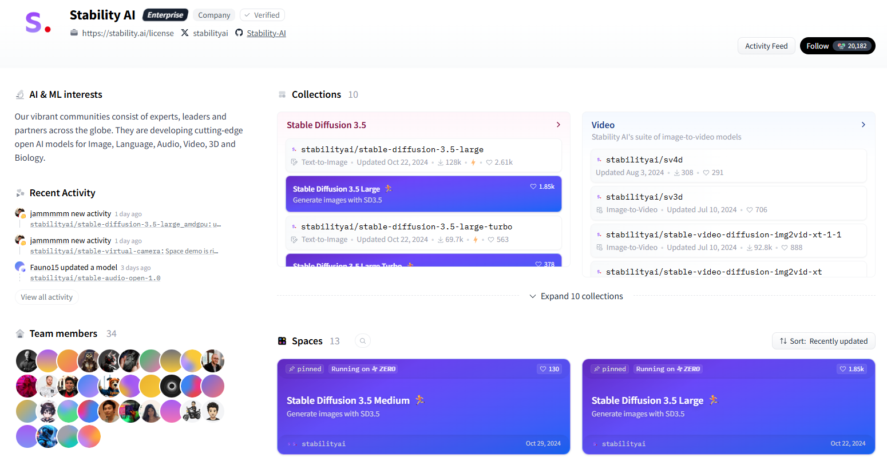
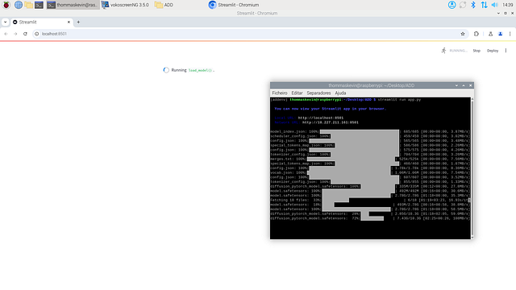
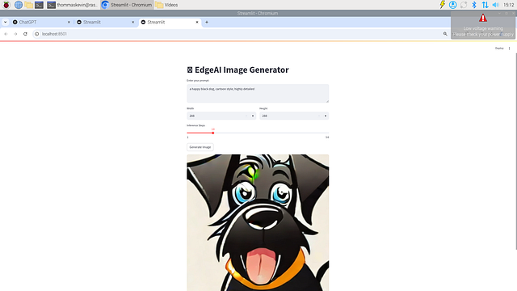

# EdgeAI - Adversarial Diffusion Distillation on Raspberry Pi

_From mathematical foundations to edge implementation_

**Social media:**

👨🏽‍💻 Github: [thommaskevin/TinyML](https://github.com/thommaskevin/TinyML)

👷🏾 Linkedin: [Thommas Kevin](https://www.linkedin.com/in/thommas-kevin-ab9810166/)

📽 Youtube: [Thommas Kevin](https://www.youtube.com/channel/UC7uazGXaMIE6MNkHg4ll9oA)

:pencil2:CV Lattes CNPq: [Thommas Kevin Sales Flores](http://lattes.cnpq.br/0630479458408181)

👨🏻‍🏫 Research group: [Conecta.ai](https://conect2ai.dca.ufrn.br/)



## SUMMARY

1 — Introduction

2 — Background

2.1 — Retriever

2.2 — Knowledge Distillation for Diffusion Models

3 — Adversarial Diffusion Distillation

3.1 — Architecture

3.2 — Functional Blocks and Training Objectives

3.3 — Training Process

4 — EdgeAI Implementation

---

## 1 - Introduction


Generative models aim to learn the underlying data distribution of a training set and synthesize new samples from that distribution. Among various approaches such as Generative Adversarial Networks (GANs) [1] and Variational Autoencoders (VAEs) [5], Denoising Diffusion Probabilistic Models (DDPMs) [2] [9] and related score-based models [10] have recently achieved unprecedented generation quality, particularly in image synthesis.

Diffusion models operate through two processes: a fixed forward (diffusion) process that gradually adds noise to the data, and a learned reverse process that iteratively removes the noise to generate a sample from pure noise. While the training process is stable and the generated samples exhibit high fidelity and diversity, the inference (sampling) process is inherently sequential and slow. Generating a single high-resolution image may require hundreds or thousands of function evaluations of a large neural network, making diffusion models impractical for applications that demand low latency, such as interactive editing or real-time generation.

To mitigate this computational bottleneck, knowledge distillation [3] has been adapted to diffusion models. Progressive Distillation [7] has shown that a student model can be trained to effectively halve the number of sampling steps required compared to its teacher model, iteratively, leading to significant speedups (e.g., reducing 1000 steps to 4 steps through multiple rounds of distillation). However, pushing distillation to the extreme limit of 1–4 steps often results in a noticeable degradation of sample quality, losing fine details and perceptual realism compared to the original teacher model or GANs operating in a single forward pass.

Adversarial Diffusion Distillation (ADD) ([8]; adapted from related concepts) enhances the distillation process by integrating an adversarial training objective, inspired by GANs. The central idea is that while the distillation loss encourages the student to match the teacher’s output distribution (often measured by L1 or L2 distance), the adversarial loss directly pushes the student’s generated samples toward the manifold of real data, improving perceptual quality and sharpness, especially in the challenging few-step regime. The student model learns to predict the denoised image (or the noise) in a single step, guided by both the teacher’s prediction and a discriminator network trained to distinguish real images from the student’s one-step generations.


## 2 - Background

### 2.1 — Retriever

Diffusion models define a forward process for adding noise $q(x_t | x_{t-1})$ that gradually adds Gaussian noise to an initial data sample $x_0$ over $T$ time steps, according to a pre-defined variance schedule $β_t$:

$$ q(x_t | x_{t-1}) = N(x_t; \sqrt{1 - β_t} \, x_{t-1}, β_t I) $$

Due to the properties of Gaussian distributions, we can sample $x_t$ directly from $x_0$ at any time step $t$:

$$ q(x_t | x_0) = N(x_t; \sqrt{\bar{\alpha}_t} \, x_0, (1 - \bar{\alpha}_t) I) \quad (1) $$

where $α_t = 1 - β_t$ and $ᾱ_t = \prod_{i=1}^t α_i$.

The goal is to learn the reverse process $p_θ(x_{t-1} | x_t)$ to remove the noise from $x_t$ back to $x_0$. This is typically parameterized by training a neural network, often a U-Net [6], denoted as $ε_θ(x_t, t)$, to predict the noise $ε$ that was added to obtain $x_t$ from $x_0$, given the noisy image $x_t$ and the time step $t$. The objective function simplifies to a denoising score-matching loss:

    $$ 
    L_{DM} = \mathbb{E}_{t, x_0, \epsilon} \left[ || \epsilon - \epsilon_\theta(\sqrt{\bar{\alpha}_t} x_0 + \sqrt{1 - \bar{\alpha}_t} \, \epsilon, t) ||^2 \right] \quad (2) 
    $$

where $t$ is uniformly sampled from ${1, ..., T}$, $x_0$ is a sample from the data distribution, and $ε ~ N(0, I)$.

During sampling, starting from pure noise $x_T ~ N(0, I)$, the model iteratively applies the learned reverse step $p_θ(x_{t-1} | x_t)$ using the noise prediction $ε_θ(x_t, t)$ to estimate $x_{t-1}$ from $x_t$. This requires $T$ sequential evaluations of $ε_θ$. Faster samplers like DDIM [11] allow for a trade-off between quality and speed by skipping steps but still require multiple evaluations.


### 2.2 — Knowledge Distillation for Diffusion Models


Knowledge distillation aims to transfer the capabilities of a large and complex "teacher" model to a smaller and faster "student" model. In the context of diffusion models, distillation focuses on reducing the number of sampling steps.


Progressive Distillation [7] trains a student model $ε_S$ to perform two teacher steps $ε_T$ in a single step. Specifically, if $x_t$ is "denoised" to $x_{t-2}$ by the teacher in two steps (through an intermediate $x_{t-1}$), the student is trained to predict $x_{t-2}$ directly from $x_t$. The loss typically minimizes the difference between the student's prediction and the teacher's two-step prediction. This process can be repeated, with the student becoming the teacher for the next round, halving the steps each time. While effective, quality may degrade when reducing to very few steps (e.g., 1-4).


## 3 - Adversarial Diffusion Distillation

ADD enhances the distillation process by adding an adversarial component to ensure the perceptual quality of the student's outputs, particularly when targeting single-step generation.

In ADD, the student model is trained to perform the entire denoising process (from a noisy state $x_t$ to a clean image prediction $x_{0\_pred\_S}$) in a single forward pass. It learns this through a combined objective:

- **Distillation Loss ($L_{distill}$)**: Ensures that the student's single-step prediction aligns with the output of the pre-trained teacher model (which may still use multiple steps or represent a clean target state). This anchors the student's learning process.

- **Adversarial Loss ($L_{adv}$)**: Enforces that the images generated by the student are realistic and indistinguishable from samples of the real data distribution. This is achieved by simultaneously training a discriminator network $D$.

### 3.1 Architecture

The training setup of ADD involves three main components (see Figure in below):




- **Teacher Model ($ε_T$ or $f_T$)**: A pre-trained, high-quality diffusion model. This model is frozen[1] during ADD training. Its role is to provide target outputs (either noise predictions $ε_T$ or clean predicted images $x_{0\_pred\_T}$) for the distillation loss.

- **Student Model ($ε_S$ or $f_S$)**: The model being trained. It typically shares the same architecture (e.g., U-Net) as the teacher but may be smaller. Its goal is to learn a single-step mapping from a noisy input $x_t$ (and time step $t$) to a clean predicted image $x_{0\_pred\_S}$. This model is updated using both the distillation loss and the adversarial loss.

- **Discriminator Model ($D$)**: A neural network (often a convolutional classifier, potentially using architectures such as PatchGAN [4]) trained to distinguish between real images ($x_0$ from the training dataset) and the clean images predicted by the student model ($x_{0\_pred\_S}$). This model is updated via the adversarial loss.


### 3.2 — Functional Blocks and Training Objectives


#### 3.2.1 - Teacher Prediction

The teacher model $ε_T$ takes $x_t$ and $t$ as input and predicts the noise $ε_T(x_t, t)$. From this, we can derive the teacher's clean image prediction:
  
  $$
  \hat{x}_{0,T} = \frac{x_t - \sqrt{1 - \bar{\alpha}_t} \epsilon_T(x_t, t)}{\sqrt{\bar{\alpha}_t}} \quad (3)
  $$

  This $x_{0\_pred\_T}$ (or sometimes $ε_T$ itself) serves as the target for the distillation loss. Crucially, gradients are not propagated back to the teacher model ($stop_{grad}$).

#### 3.2.2 - Student Prediction

Similarly, the student model $ε_S$ predicts the noise $ε_S(x_t, t)$. Its corresponding clean image prediction is:

  $$
  \hat{x}_{0,S} = \frac{x_t - \sqrt{1 - \bar{\alpha}_t} \epsilon_S(x_t, t)}{\sqrt{\bar{\alpha}_t}} \quad (4)
  $$

  This $x_{0\_pred\_S}$ is used both in the distillation loss and as the input (fake sample) for the discriminator.


#### 3.2.3 - Distillation Loss

Distillation Loss ($L_{distill}$), this loss measures the discrepancy between the student’s prediction and the teacher’s prediction. It is often an L1 or L2 norm, applied either to the noise predictions or the clean image predictions:

    $$
    L_{\text{distill}} = \mathbb{E}_{x_0, \epsilon, t} \left[ w(t) \cdot \| \epsilon_S(x_t, t) - \text{stop\_grad}(\epsilon_T(x_t, t)) \|^p \right] 
    \quad (5)
    $$

This is the noise-prediction formulation; an $x_0$-prediction formulation is also common. Here, $p$ is typically 1 or 2, and $w(t)$ is an optional weighting function based on the timestep $t$. This loss encourages the student to match the functional mapping learned by the teacher.


#### 3.2.4 - Adversarial Loss

Adversarial Loss ($L_{adv}$), this component involves the student $S$ (acting as generator) and the discriminator $D$. The discriminator $D$ is trained to output a high value for real images ($x_0$) and a low value for student-generated images ($x_{0\_pred\_S}$). The student is trained to generate $x_{0\_pred\_S}$ such that $D$ outputs a high value (i.e., fooling the discriminator). A common formulation is the non-saturating GAN loss:


- **Discriminator Loss ($L_D$):** The discriminator maximizes this objective (or minimizes its negative). $stop_grad$ prevents gradients from flowing back into the student during discriminator updates.
    $$
    L_D = \mathbb{E}_{x_0} [ -\log(D(x_0)) ] + \mathbb{E}_{x_0, \epsilon, t} [ -\log(1 - D(\text{stop\_grad}(\hat{x}_{0,S}))) ] \quad (6)
    $$


- **Student Adversarial Loss ($L_adv_S$):** 
The student minimizes this objective, effectively trying to maximize the discriminator’s output on its generated images.

    $$
    L_{\text{adv\_S}} = \mathbb{E}_{x_0, \epsilon, t} [ -\log(D(\hat{x}_{0,S})) ] \quad (7)
    $$


- **Combined Student Loss ($L_S$)**: The student model $ε_S$ is trained to minimize a weighted sum of the distillation loss and its adversarial loss:

  $$
  L_S = \lambda_{\text{distill}} L_{\text{distill}} + \lambda_{\text{adv}} L_{\text{adv\_S}} \quad (8)
  $$

where $λ_{distill}$ and $λ_{adv}$ are hyperparameters that balance the contribution of each loss component.


### 3.3 — Training Process


Training typically follows an alternating optimization scheme similar to standard GAN training:

- **Sample:** Select a real image $x_0$, a random timestep $t$, and random noise $ε$. Compute the noisy image $x_t$ using Equation 1. (For conditional models such as text-to-image, also sample the condition $c$, such as a text prompt.)

- **Generate:** Pass $x_t$ and $t$ (and $c$, if conditional) through both the frozen teacher $ε_T$ (to obtain the distillation target) and the student $ε_S$ (to obtain the student’s prediction $x_{0\_pred\_S}$).

-  **Update Discriminator:** Compute the discriminator loss $L_D$ (potentially using $c$ if it's a conditional discriminator) and update the parameters of $D$.

- **Update Student:** Compute the losses $L_{distill}$ and $L_{adv\_S}$ (potentially using $c$) and the combined loss $L_S$. Update the parameters of $ε_S$.

- Repeat steps 1–4 until convergence.


## 4 - EdgeAI Implementation

With this example you can implement the machine learning algorithm in Raspberry Pi.


### 4.0 - Gather the necessary materials

- Raspberry Pi 5 with 16Gb (with a compatible power cable)

- MicroSD card (minimum 64 GB, 126 GB or higher recommended)

- Computer with an SD card reader or USB adapter

- HDMI cable and a monitor/TV

- USB keyboard and mouse (or Bluetooth if supported)

- Internet connection (via Wi-Fi or Ethernet cable)


### 4.1 - Download and install the operating system


Visit [here](https://medium.com/@thommaskevin/edgeai-llama-on-raspberry-pi-4-4dffd65d33ab) to do how download and install the operating system in Raspberry pi 4 or 5.


### 4.2 - Update the system

```bash
sudo apt update && sudo apt upgrade -y
```

### 4.3 - Creat and Active a Virtual Environment

```bash
python3 -m venv addenv
source addenv/bin/activate
```

### 4.4 - Install Requirements

```bash
pip install -r requirements.txt
```


### 4.5 - Chose the ADD Model

Select a model click: [link](https://huggingface.co/stabilityai). For this example, the "stabilityai/sdxl-turbo" as selected.




### 4.6 - ADD Implementation

This app uses the [Streamlit](https://streamlit.io/) library to create a web interface that allows users to generate images from text prompts using the **SDXL-Turbo** model from **Stability AI**, provided by the [diffusers](https://huggingface.co/docs/diffusers/index) library.


#### 4.6.1 - Imports

```python
import streamlit as st
from diffusers import AutoPipelineForText2Image
import torch
from PIL import Image
import io
```

#### 4.6.2 - Model Loading

```python
@st.cache_resource
def load_model():
    device = "cuda" if torch.cuda.is_available() else "cpu"
    # Use float16 for GPU, otherwise use float32 for CPU
    dtype = torch.float16 if torch.cuda.is_available() else torch.float32
    model = "stabilityai/sdxl-turbo"
    return AutoPipelineForText2Image.from_pretrained(model, torch_dtype=dtype).to(device)

pipeline = load_model()
```

- The `load_model()` function loads the **SDXL-Turbo** model.
- Uses `torch.float16` for memory efficiency and performance.
- The model is sent to **GPU** (`cuda`) if available, otherwise to **CPU**.
- `@st.cache_resource` ensures the model loads **only once**, even after interface reloads.


#### 4.6.3 - User Interface

```python
st.title("🖼️ AI Image Generator")
```

Sets the application title.

```python
prompt = st.text_area("Enter your prompt:", "a happy black dog, cartoon style, highly detailed")
```

- A text area where the user writes the image prompt.
- A default example is provided.

```python
col1, col2 = st.columns(2)
width = col1.number_input("Width", min_value=256, max_value=1024, value=800, step=64)
height = col2.number_input("Height", min_value=256, max_value=1024, value=800, step=64)
steps = st.slider("Inference Steps", 1, 50, 10)
```

- Creates two side-by-side fields to adjust **image width** and **height**.
- The number of **inference steps** (higher = better quality, but slower) is adjustable via a slider.


#### 4.6.4 - Image Generation and Download

- When the button is clicked, the image is generated using the `pipeline`.
- The `pipeline()` function generates the image based on the prompt and parameters.
- `st.image()` displays the image on the interface.

```python
if st.button("Generate Image"):
    with st.spinner("Generating image..."):
        try:
            result = pipeline(prompt=prompt, width=width, height=height, num_inference_steps=steps)
            image = result.images[0]
            st.image(image, use_container_width=True)

            # Convert image to buffer
            img_buffer = io.BytesIO()
            image.save(img_buffer, format="PNG")
            img_bytes = img_buffer.getvalue()

            st.download_button("💾 Download Image", img_bytes, "generated.png", "image/png")
        except Exception as e:
            st.error(f"Error generating image: {e}")
```

- The generated image is converted to a **byte buffer** in PNG format.
- A download button lets the user save the image locally.


#### 4.7 - Full Code

```python
import asyncio
import streamlit as st
from diffusers import AutoPipelineForText2Image
import torch
from PIL import Image
import io

# Ensure an event loop is available
try:
    asyncio.get_event_loop()
except RuntimeError:
    asyncio.set_event_loop(asyncio.new_event_loop())

# Model setup
@st.cache_resource
def load_model():
    device = "cuda" if torch.cuda.is_available() else "cpu"
    # Use float16 for GPU, otherwise use float32 for CPU
    dtype = torch.float16 if torch.cuda.is_available() else torch.float32
    model = "stabilityai/sdxl-turbo"
    return AutoPipelineForText2Image.from_pretrained(model, torch_dtype=dtype).to(device)

pipeline = load_model()

# Interface setup
st.title("🖼️ EdgeAI Image Generator")

prompt = st.text_area("Enter your prompt:", "a happy black dog, cartoon style, highly detailed")

col1, col2 = st.columns(2)
width = col1.number_input("Width", min_value=256, max_value=1024, value=800, step=64)
height = col2.number_input("Height", min_value=256, max_value=1024, value=800, step=64)
steps = st.slider("Inference Steps", 1, 50, 10)

if st.button("Generate Image"):
    with st.spinner("Generating image..."):
        try:
            result = pipeline(prompt=prompt, width=width, height=height, num_inference_steps=steps)
            image = result.images[0]
            st.image(image, use_container_width=True)

            # Convert image to buffer
            img_buffer = io.BytesIO()
            image.save(img_buffer, format="PNG")
            img_bytes = img_buffer.getvalue()

            st.download_button("💾 Download Image", img_bytes, "generated.png", "image/png")
        except Exception as e:
            st.error(f"Error generating image: {e}")
```


### 4.8 - Run the application

create a folder with the name of the project and place the file app.py in this folder. Navigate to this folder from the prompt (with addvenv still active) and run:

```bash
streamlit run app.py
```


### 4.9 - Results







**References:**

[1] Goodfellow, I., et al. (2014). Generative Adversarial Nets. *NIPS*.

[2] Ho, J., et al. (2020). Denoising Diffusion Probabilistic Models. *NeurIPS*.

[3] Hinton, G., et al. (2015). Distilling the Knowledge in a Neural Network. *arXiv*.

[4] Isola, P., et al. (2017). Image-to-Image Translation with Conditional Adversarial Networks. *CVPR*.

[5] Kingma, D. P., & Welling, M. (2013). Auto-Encoding Variational Bayes. *arXiv*.

[6] Ronneberger, O., et al. (2015). U-Net: Convolutional Networks for Biomedical Image Segmentation. *MICCAI*.

[7] Salimans, T., & Ho, J. (2022). Progressive Distillation for Fast Sampling of Diffusion Models. *ICLR*.

[8] Sauer, A., et al. (2023). Adversarial Diffusion Distillation. *arXiv*. 

[9] Sohl-Dickstein, J., et al. (2015). Deep Unsupervised Learning using Nonequilibrium Thermodynamics. *ICML*.

[10] Song, J., & Ermon, S. (2019). Generative Modeling by Estimating Gradients of the Data Distribution. *NeurIPS*.

[11] Song, J., et al. (2020). Denoising Diffusion Implicit Models. *ICLR*.
