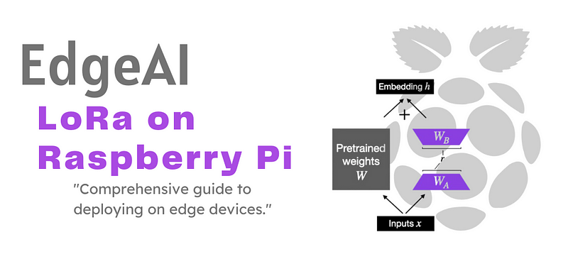
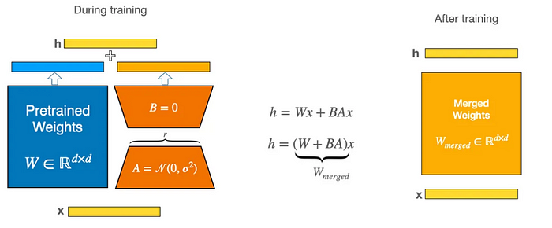
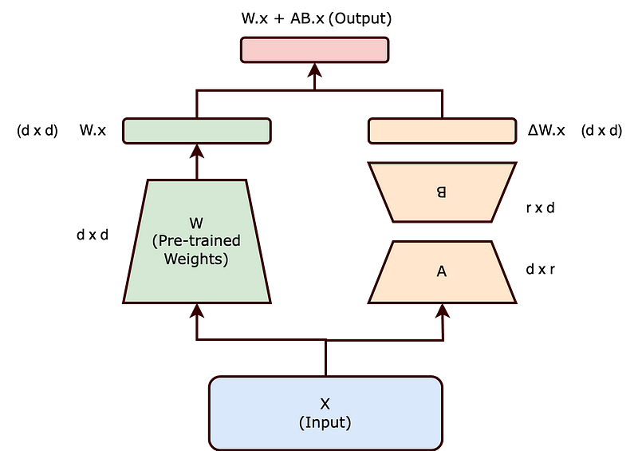
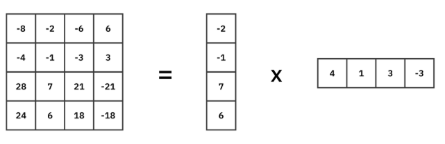
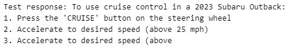
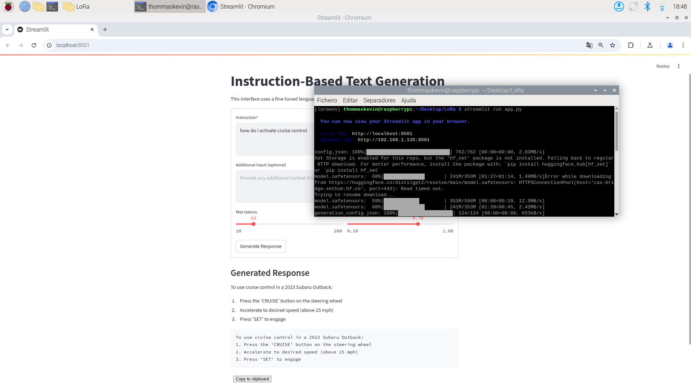
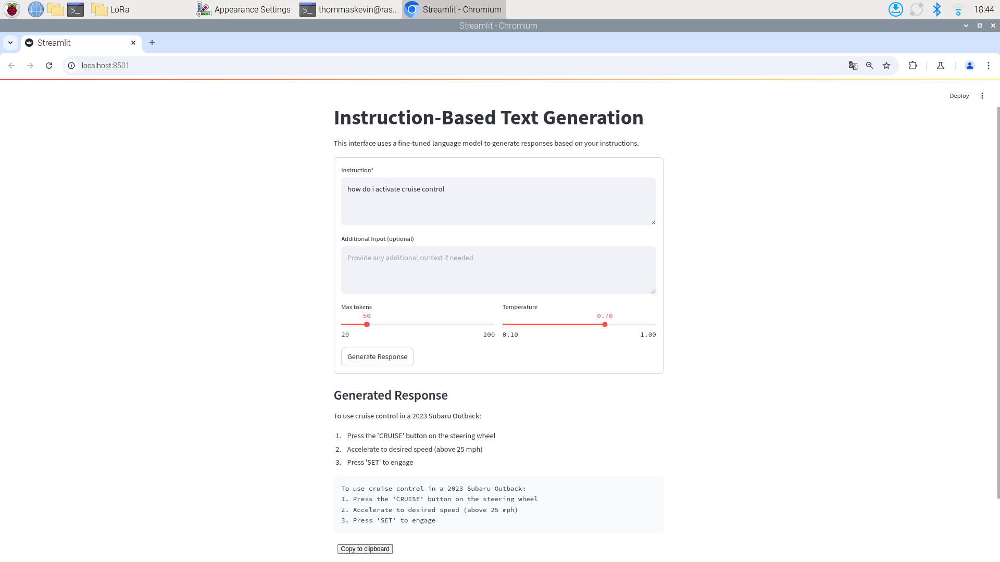

# EdgeAI - Low-Rank Adaptation (LoRa) on Raspberry Pi

_From mathematical foundations to edge implementation_

**Social media:**

👨🏽‍💻 Github: [thommaskevin/TinyML](https://github.com/thommaskevin/TinyML)

👷🏾 Linkedin: [Thommas Kevin](https://www.linkedin.com/in/thommas-kevin-ab9810166/)

📽 Youtube: [Thommas Kevin](https://www.youtube.com/channel/UC7uazGXaMIE6MNkHg4ll9oA)

:pencil2:CV Lattes CNPq: [Thommas Kevin Sales Flores](http://lattes.cnpq.br/0630479458408181)

👨🏻‍🏫 Research group: [Conecta.ai](https://conect2ai.dca.ufrn.br/)



## SUMMARY

1 — Introduction

1.1 — A Mathematical Perspective  

2 — Low-Rank Adaptation (LoRA)  

3 — EdgeAI Implementation

---

## 1 - Introduction


Supervised fine-tuning (SFT) is a crucial technique in machine learning (ML) and deep learning that adapts a pre-trained model to a specific downstream task using labeled data. While pre-trained models, such as those based on transformer architectures (e.g., BERT, GPT), learn general representations from vast amounts of unlabeled data through self-supervised learning, they often require additional refinement to perform optimally on domain-specific tasks like sentiment analysis, text classification, or medical diagnosis. Supervised fine-tuning bridges this gap by further training the model on task-specific labeled datasets, enabling it to specialize in the target application.

The process typically involves taking a pre-trained model and continuing its training on a smaller, annotated dataset relevant to the desired task. By fine-tuning, the model retains its broad knowledge from pre-training while adapting its parameters to improve performance on the new objective. This approach has proven highly effective in natural language processing (NLP), computer vision, and other domains, as it reduces the need for training models from scratch, saving computational resources and time.

Despite its advantages, supervised fine-tuning presents challenges, including the risk of overfitting when the labeled dataset is small and the potential for catastrophic forgetting, where the model loses previously learned general knowledge. Researchers have developed various strategies, such as layer-wise learning rate decay, regularization techniques, and prompt-based fine-tuning, to mitigate these issues.

### 1.1 - A Mathematical Perspective

Let $f_\theta$ be a pre-trained large language model (LLM), parameterized by $\theta$, capable of modeling complex language distributions. The objective of SFT is to adapt $f_\theta$ to a new task-specific dataset $\mathcal{D} = \{(x_i, y_i)\}$, where:

- $x_i$: input prompt (e.g., question, instruction)  
- $y_i$: desired output (e.g., answer or response)  

We aim to minimize the supervised loss:

$$
\theta^*= arg \min_\theta \sum_{(x, y) \in \mathcal{D}} \mathcal{L}(x_i, y_i; \theta)
$$

where $\mathcal{L}(x, y; \theta)$ measures how well the model’s prediction matches the target.

This fine-tuning process is discriminative in nature: it focuses on conditioning on the input x and learning to predict y accurately.


#### 1.1.1 - Token-Level Cross-Entropy (CE)

Since inputs and outputs are sequences, SFT operates at the token level. Let:

$$
y_i = (y_{i,1}, y_{i,2}, \ldots, y_{i,T_i})
$$

The **token-level cross-entropy loss** is:

$$
\mathcal{L}_\text{i}(\theta) = - \sum_{t=1}^{T_i} \log p_\theta(y_{i,t} \mid  y_{i,<t}, x_i)
$$

Where:

- $y_{i,<t} = (y_{i,1}, \ldots, y_{i,t-1})$  
- $p_\theta(\cdot)$: predicted probability distribution  

This loss encourages the model to assign high probability to the correct next token at each step, conditioning jointly on the input and the partial output history.

Thus, fine-tuning turns the generation problem into a sequence of autoregressive prediction tasks


#### 1.1.2 — Optimization Procedure

Optimization uses stochastic gradient descent (SGD) or its adaptive variants (e.g., Adam, AdamW):

$$
\theta \leftarrow \theta - \eta \nabla_\theta \mathcal{L}(\theta)
$$

Where:

- $\eta$: learning rate  
- $\nabla_\theta \mathcal{L}(\theta)$ is the gradient of the loss with respect to the model parameters.

**Important techniques**:
- Learning rate schedules (e.g., cosine decay, linear warm-up);  
- Regularization (e.g., weight decay, dropout);  
- Gradient clipping(to prevent exploding gradients).


## 2 - Low-Rank Adaptation (LoRA)

LoRA (Low-Rank Adaptation) is a parameter-efficient fine-tuning technique that freezes the pre-trained model weights and injects trainable rank decomposition matrices into the model's layers. Instead of training all model parameters during fine-tuning, LoRA decomposes the weight updates into smaller matrices through low-rank decomposition, significantly reducing the number of trainable parameters while maintaining model performance

**How it works:**

- The original pre-trained weights remain frozen (unchanged);

- Two low-rank matrices, A and B, are introduced into selected layers via decomposition techniques;

- During fine-tuning, only these small, additional matrices are trained, significantly reducing the number of trainable parameters;

- At inference time, the contributions of A and B are efficiently integrated into the layer's computation, maintaining performance with minimal overhead.


The diagram illustrates how LoRA (Low-Rank Adaptation) leverages low-rank matrices A and B to capture updates to the pretrained weights. Instead of modifying the original weights directly, LoRA introduces smaller, trainable matrices of rank r that approximate the necessary adaptations. Once training is complete, these low-rank updates are merged into the final weight matrix, allowing the model to incorporate the learned changes without altering the original pretrained parameters.




The central hypothesis behind LoRA (Low-Rank Adaptation) is that the weight matrices in many deep neural networks reside in a lower-dimensional subspace. In essence, the original high-dimensional weight matrices can be approximated through low-rank decomposition without significant loss of information.

Let $W_0 \in \mathbb{R}^{d \times k}$ be a frozen weight matrix. Instead of updating $W_0$, LoRA defines:

$$
\Delta W = A B, \quad \text{where } r \ll \min(d, k)
$$

So the effective adapted matrix becomes:

$$
W = W_0 + \alpha A B
$$

- $\alpha$: a **scaling factor** controlling the adaptation’s magnitude

This reduces the number of trainable parameters and is particularly effective in low-data or edge scenarios.

During fine-tuning, only the matrices A and B are updated while the original pretrained weights W0​ remain unchanged. This dramatically reduces the number of trainable parameters and enables efficient adaptation, especially in resource-constrained or low-data scenarios.

Once training is complete, the low-rank updates AB can be merged into the model, resulting in an effective weight matrix W without modifying the original pretrained parameters. This makes LoRA a highly efficient and modular approach for parameter-efficient transfer learning.




LoRA introduces a scaling factor $\alpha$ that controls the magnitude of the adaptation:

$$
W \cdot x + \left( \frac{\alpha}{r} \right) \cdot B(A \cdot x)
$$

The scaling factor helps to balance the contribution of the adaptation relative to the original weights.

After training, for efficiency, the LoRA weights can be merged with the original weights:

$$
W_{\text{adapted}} = W + \left( \frac{\alpha}{r} \right) \cdot BA
$$

**Numerical Example:** A high-rank matrix can be decomposed into two low-rank matrices, a 4 x 4 matrix can be decomposed into a 4 x 1 and a 1 x 4 matrix.




By factorizing the weight matrix W∈Rd×d into two lower-rank matrices B∈Rd×r and A∈Rr×d, the number of trainable parameters is significantly reduced. While directly updating W would require learning d² parameters, the LoRA approach only requires learning 2dr parameters, which is much more efficient when dr≪d.


This reduction in trainable parameters, as implemented in LoRA, brings several important benefits when fine-tuning large-scale neural networks:

- **Reduced Memory Footprint:** By reducing the number of updated parameters, LoRA lowers memory consumption, making it easier to work with large models;

- **Faster Training and Adaptation:** With fewer parameters to optimize, LoRA accelerates both training and task-specific adaptation.

- **Compatibility with Modest Hardware:** LoRA enables the fine-tuning of large models even on limited hardware, such as consumer-grade GPUs or CPUs.

- **Scalability:** By decoupling model size from fine-tuning complexity, LoRA allows researchers and practitioners to scale up models without proportionally increasing computational requirements.


## 3 - EdgeAI Implementation

With this example you can implement the LLM in Raspberry Pi.


### 3.1 - Desktop Fine-Tuning

#### 3.1.1 - Requirements

Make sure you have the following Python libraries installed:

```bash
pip install transformers datasets peft accelerate torch
```

#### 3.1.2 - Load and Prepare Your Dataset

First, we load the dataset from a .jsonl file and convert each entry into a single string with both instruction and output.

```python
from datasets import load_dataset

def convert_to_hf_format(example):
    return {
        "text": f"Instruction: {example['instruction']}\nOutput: {example['output']}"
    }

dataset = load_dataset('json', data_files='dataset.jsonl')
dataset = dataset.map(convert_to_hf_format)
dataset = dataset["train"].train_test_split(test_size=0.2)
```

#### 3.1.3 - Load the Pretrained Model and Tokenizer

Use Hugging Face to load the model and tokenizer. If the tokenizer lacks a pad_token, we use the eos_token.

```python
from transformers import AutoModelForCausalLM, AutoTokenizer

model_name = "distilgpt2"
tokenizer = AutoTokenizer.from_pretrained(model_name)
model = AutoModelForCausalLM.from_pretrained(model_name)

if tokenizer.pad_token is None:
    tokenizer.pad_token = tokenizer.eos_token
```

#### 3.1.4 - Tokenize the Dataset

Tokenize the combined "instruction + output" text using a fixed max_length.

```python
def tokenize_function(examples):
    return tokenizer(examples["text"], padding="max_length", truncation=True, max_length=128)

tokenized_datasets = dataset.map(tokenize_function, batched=True)
```

#### 3.1.5 - Prepare Model for LoRA Training

Enable LoRA fine-tuning and quantization-aware training using PEFT:

```python
from peft import prepare_model_for_kbit_training

model = prepare_model_for_kbit_training(model)
```

#### 3.1.6 - Configure and Inject LoRA

Set up LoRA with desired hyperparameters and specify which modules to adapt:

```python
from peft import LoraConfig, get_peft_model

lora_config = LoraConfig(
    r=16,
    lora_alpha=32,
    target_modules=["c_attn", "c_proj"],
    lora_dropout=0.05,
    bias="none",
    task_type="CAUSAL_LM",
    inference_mode=False
)

model = get_peft_model(model, lora_config)
model.print_trainable_parameters()
```

#### 3.1.7 - Define Data Collator

We use a data collator for causal language modeling without masked language modeling (MLM).

```python
from transformers import DataCollatorForLanguageModeling

data_collator = DataCollatorForLanguageModeling(
    tokenizer=tokenizer,
    mlm=False
)
```


#### 3.1.8 - Set Training Arguments

Configure training parameters like learning rate, batch size, and evaluation strategy.

```python
from transformers import TrainingArguments

training_args = TrainingArguments(
    output_dir="./lora_results",
    eval_strategy="steps",
    eval_steps=100,
    learning_rate=1e-3,
    per_device_train_batch_size=4,
    per_device_eval_batch_size=4,
    num_train_epochs=100,
    weight_decay=0.01,
    logging_steps=10,
    save_strategy="steps",
    save_steps=100,
    load_best_model_at_end=True,
    report_to="none",
)
```

#### 3.1.9 - Initialize Trainer

Bring everything together with the Hugging Face Trainer.

```python
from transformers import Trainer

trainer = Trainer(
    model=model,
    args=training_args,
    train_dataset=tokenized_datasets["train"],
    eval_dataset=tokenized_datasets["test"],
    data_collator=data_collator,
)
```

#### 3.1.10 - Train the Model

Start the training process:

```python
trainer.train()
```

#### 3.1.11 - Save Your Model and Tokenizer

Save the fine-tuned model

```python
model = AutoModelForCausalLM.from_pretrained("lora_finetuned_model")
tokenizer = AutoTokenizer.from_pretrained("distilgpt2_tokenizer")
```


#### 3.1.12 - Test Your Model and Tokenizer

Define a simple generation function to test.

```python
from transformers import AutoModelForCausalLM, AutoTokenizer

model = AutoModelForCausalLM.from_pretrained("lora_finetuned_model")
tokenizer = AutoTokenizer.from_pretrained("distilgpt2_tokenizer")
```

```python
def generate_response(instruction, input_text=""):
    prompt = f"Instruction: {instruction}\nOutput:" if not input_text else f"Instruction: {instruction}\nInput: {input_text}\nOutput:"
    inputs = tokenizer(prompt, return_tensors="pt")
    outputs = model.generate(
        input_ids=inputs["input_ids"],
        attention_mask=inputs["attention_mask"],
        max_new_tokens=50,
        pad_token_id=tokenizer.eos_token_id,
        temperature=0.7
    )
    return tokenizer.decode(outputs[0], skip_special_tokens=True).split("Output:")[-1].strip()
```

```python
# Example Test
print("Test response:", generate_response("How do I activate cruise control?"))
```




### 3.2 - Edge Implementation

#### 3.2.1 - Gather the necessary materials

- Raspberry Pi 5 with 16Gb (with a compatible power cable)

- MicroSD card (minimum 64 GB, 126 GB or higher recommended)

- Computer with an SD card reader or USB adapter

- HDMI cable and a monitor/TV

- USB keyboard and mouse (or Bluetooth if supported)

- Internet connection (via Wi-Fi or Ethernet cable)


#### 3.2.2 - Download and install the operating system


Visit [here](https://medium.com/@thommaskevin/edgeai-llama-on-raspberry-pi-4-4dffd65d33ab) to do how download and install the operating system in Raspberry pi 4 or 5.


#### 3.2.3 - Update the system

```bash
sudo apt update && sudo apt upgrade -y
```

#### 3.2.4 - Creat and Active a Virtual Environment

```bash
python3 -m venv addenv
source addenv/bin/activate
```

#### 3.2.5 - Install Requirements

```bash
pip install -r requirements.txt
```

#### 3.2.6 - Copy Model and Tokenizer folder

Copy the Finetuned folder "lora_finetuned_model" and "distilgpt2_tokenizer" to Raspberry Pi 5


#### 3.2.7 - Interface Implementation

This app uses the [Streamlit](https://streamlit.io/) library to create a web interface that allows users to generate images from text prompts using the **SDXL-Turbo** model from **Stability AI**, provided by the [diffusers](https://huggingface.co/docs/diffusers/index) library.


#### 3.2.8 - Imports

```python
import streamlit as st
from transformers import AutoModelForCausalLM, AutoTokenizer
import streamlit.components.v1 as components
```

#### 3.2.9 - Model and Tokenizer Loading

```python
@st.cache_resource
def load_model():
    model = AutoModelForCausalLM.from_pretrained("lora_finetuned_model") 
    tokenizer = AutoTokenizer.from_pretrained("distilgpt2_tokenizer")
    return model, tokenizer

model, tokenizer = load_model()
```

#### 3.2.10 - Generate Response

```python
def generate_response(instruction, input_text="", max_tokens=50, temperature=0.7):
    prompt = f"Instruction: {instruction}\nOutput:" if not input_text else f"Instruction: {instruction}\nInput: {input_text}\nOutput:"
    inputs = tokenizer(prompt, return_tensors="pt")
    outputs = model.generate(
        input_ids=inputs["input_ids"],
        attention_mask=inputs["attention_mask"],
        max_new_tokens=max_tokens,
        pad_token_id=tokenizer.eos_token_id,
        temperature=temperature,
        do_sample=True  # necessário com temperature
    )
    return tokenizer.decode(outputs[0], skip_special_tokens=True).split("Output:")[-1].strip()
```


#### 3.2.11 - User Interface

```python
# Streamlit UI
st.title("Instruction-Based Text Generation")
st.write("This interface uses a fine-tuned language model to generate responses based on your instructions.")

# Input form
with st.form("generation_form"):
    instruction = st.text_area("Instruction*", 
                             placeholder="Enter your instruction here (e.g., 'How do I activate cruise control?')",
                             height=100)
    input_text = st.text_area("Additional Input (optional)", 
                             placeholder="Provide any additional context if needed",
                             height=100)
    
    col1, col2 = st.columns(2)
    with col1:
        max_tokens = st.slider("Max tokens", 20, 200, 50)
    with col2:
        temperature = st.slider("Temperature", 0.1, 1.0, 0.7)
    
    submitted = st.form_submit_button("Generate Response")

# Generate and display response
if submitted:
    if not instruction:
        st.error("Please enter an instruction")
    else:
        with st.spinner("Generating response..."):
            response = generate_response(instruction, input_text, max_tokens, temperature)
        
        st.subheader("Generated Response")
        st.write(response)
        
        st.code(response, language="text")
        
        # Working copy button with JS
        components.html(f"""
        <button onclick="navigator.clipboard.writeText(`{response}`)">Copy to clipboard</button>
        """, height=40)
```

#### 3.2.12 - Full Code

```python
import streamlit as st
from transformers import AutoModelForCausalLM, AutoTokenizer
import streamlit.components.v1 as components

# Load model and tokenizer
@st.cache_resource
def load_model():
    model = AutoModelForCausalLM.from_pretrained("lora_finetuned_model")  # Ou use PEFT se necessário
    tokenizer = AutoTokenizer.from_pretrained("distilgpt2_tokenizer")
    return model, tokenizer

model, tokenizer = load_model()

def generate_response(instruction, input_text="", max_tokens=50, temperature=0.7):
    prompt = f"Instruction: {instruction}\nOutput:" if not input_text else f"Instruction: {instruction}\nInput: {input_text}\nOutput:"
    inputs = tokenizer(prompt, return_tensors="pt")
    outputs = model.generate(
        input_ids=inputs["input_ids"],
        attention_mask=inputs["attention_mask"],
        max_new_tokens=max_tokens,
        pad_token_id=tokenizer.eos_token_id,
        temperature=temperature,
        do_sample=True  # necessário com temperature
    )
    return tokenizer.decode(outputs[0], skip_special_tokens=True).split("Output:")[-1].strip()

# Streamlit UI
st.title("Instruction-Based Text Generation")
st.write("This interface uses a fine-tuned language model to generate responses based on your instructions.")

# Input form
with st.form("generation_form"):
    instruction = st.text_area("Instruction*", 
                             placeholder="Enter your instruction here (e.g., 'How do I activate cruise control?')",
                             height=100)
    input_text = st.text_area("Additional Input (optional)", 
                             placeholder="Provide any additional context if needed",
                             height=100)
    
    col1, col2 = st.columns(2)
    with col1:
        max_tokens = st.slider("Max tokens", 20, 200, 50)
    with col2:
        temperature = st.slider("Temperature", 0.1, 1.0, 0.7)
    
    submitted = st.form_submit_button("Generate Response")

# Generate and display response
if submitted:
    if not instruction:
        st.error("Please enter an instruction")
    else:
        with st.spinner("Generating response..."):
            response = generate_response(instruction, input_text, max_tokens, temperature)
        
        st.subheader("Generated Response")
        st.write(response)
        
        st.code(response, language="text")
        
        # Working copy button with JS
        components.html(f"""
        <button onclick="navigator.clipboard.writeText(`{response}`)">Copy to clipboard</button>
        """, height=40)

```


#### 3.2.13 - Run the application

create a folder with the name of the project and place the file app.py in this folder. Navigate to this folder from the prompt (with addvenv still active) and run:

```bash
streamlit run app.py
```
Waiting the installations



#### 3.2.14 - Results

Consult result:




