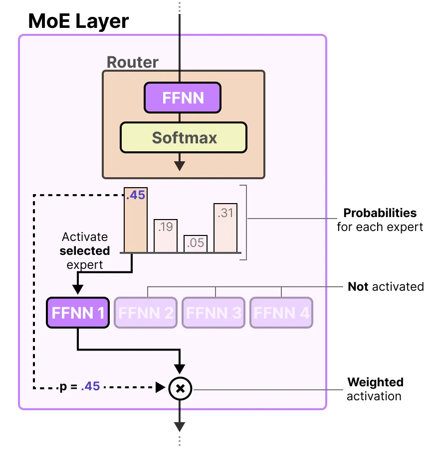

# EdgeAI - Mixture of Experts (MoE) on Raspberry Pi

_From mathematical foundations to edge implementation_

**Social media:**

👨🏽‍💻 Github: [thommaskevin/TinyML](https://github.com/thommaskevin/TinyML)

👷🏾 Linkedin: [Thommas Kevin](https://www.linkedin.com/in/thommas-kevin-ab9810166/)

📽 Youtube: [Thommas Kevin](https://www.youtube.com/channel/UC7uazGXaMIE6MNkHg4ll9oA)

:pencil2:CV Lattes CNPq: [Thommas Kevin Sales Flores](http://lattes.cnpq.br/0630479458408181)

👨🏻‍🏫 Research group: [Conecta.ai](https://conect2ai.dca.ufrn.br/)


## SUMMARY

1 — Introduction

1.1 — A Mathematical Perspective  

2 — Mathematical Foundations

3 — EdgeAI Implementation

---

## 1 - Introduction

The **Mixture-of-Experts (MoE)** paradigm is a machine learning technique that has gained considerable prominence, particularly in the context of **Large Language Models (LLMs)**. Its main appeal lies in the ability to **scale model capacity** without incurring a proportional increase in computational cost. At its core, an MoE employs multiple neural sub-networks, referred to as *experts*, to partition the problem space into more homogeneous regions. This design embodies a form of ensemble learning, where specialized components collaborate to enhance overall performance.

### 1.1 - Why MoE?

The motivation for adopting MoE architectures stems from several key advantages:

* **Model Capacity**
  MoE allows for an increase in model capacity—the degree of complexity that the model can capture—without requiring all parameters to be active during inference. This is achieved by replacing dense layers with MoE layers, where each expert sub-network has the same dimensionality as the original dense layer.

* **Computational Efficiency**
  Sparse MoE models exhibit improved efficiency in terms of FLOPs (floating-point operations) per parameter. Instead of activating all parameters, only a selected subset of experts is engaged for each input. This selective activation reduces the computational cost per token.

* **Reduced Training Cost**
  Because FLOPs per weight are used more efficiently, MoE enables the training of larger and more capable models under fixed computational or financial constraints. In practice, this means that more tokens can be processed within the same budget.

* **Lower Latency**
  In scenarios where computational resources form a bottleneck, MoE can reduce the latency associated with generating the first token. This property is particularly valuable in applications that demand multiple sequential calls to the model.


### 1.2 - Components of MoE

The architecture of a Mixture-of-Experts can be understood through two fundamental components:


#### 1.2.1 - Experts

Experts are neural sub-networks—most commonly **Feedforward Neural Networks (FFNNs)**—that collectively form the mixture. Within an MoE layer, each traditional dense FFNN is replaced by a pool of experts, of which only a subset is activated for a given input. Each expert receives the same input and produces an output vector.

It is important to emphasize that experts are **not** domain-specific (e.g., “Psychology” or “Biology”). Instead, their specialization emerges at a **syntactic or token level**, allowing them to handle particular linguistic or contextual patterns.

#### 1.2.2 - Router (Gating Network)

The Router—also known as the **Gating Network**—is responsible for selecting which experts should be activated for a given input. It processes the input and generates a weight vector, where each weight reflects the relative importance of an expert. During training, the router learns to route tokens toward the most relevant experts, thereby ensuring both efficiency and specialization.


Here is your text rewritten in **formal English** with clear **subsections by MoE components**, improving structure and readability while keeping all the mathematical rigor intact:


## 2 — Mathematical Foundations

A **Mixture-of-Experts (MoE)** model partitions the mapping from inputs to outputs across a set of specialized submodels, known as **experts**, and employs a **gating network** to determine how expert outputs are combined for each input. This section presents the mathematical formulation and training dynamics of MoE, organized by its key components.


### 2.1 — Experts

Let $x\in\mathbb{R}^d$ denote an input vector, and let $M$ denote the number of experts. Each expert $i$ is parameterized by $\theta_i$ and defines a function

$$
f_i(x;\theta_i).
$$

Depending on the task, an expert may output a scalar value, a vector, or a probability distribution. The experts collectively define the representational capacity of the MoE model.


### 2.2 — Gating Network (Router)

The gating network or Router, parameterized by $\phi$, determines the contribution of each expert to the final prediction. It outputs a vector of non-negative weights:

$$
g(x;\phi) = (g_1(x;\phi), \dots, g_M(x;\phi)),
$$

with the constraints

$$
g_i(x;\phi) \ge 0, \quad \sum_{i=1}^M g_i(x;\phi)=1.
$$

Thus, the prediction is the convex combination

$$
\hat{y}(x) = \sum_{i=1}^M g_i(x;\phi)\, f_i(x;\theta_i).
$$


A common formulation computes **gating logits** $h_i(x;\phi)$ (e.g., $h_i(x;\phi) = w_i^\top x + b_i$ or via a small neural network) and applies the softmax:

$$
g_i(x;\phi) = \frac{\exp(h_i(x;\phi))}{\sum_{j=1}^M \exp(h_j(x;\phi))}.
$$

The Router outputs probabilities which it uses to select the best matching expert:



The MoE layer is composed of the router and a subset of experts, with only a limited number being activated for each input:


An MoE layer can be organized in two main ways: sparse or dense. In both cases, the router is responsible for directing the input to the experts. In the Sparse MoE, only a few experts are chosen to process the information, which makes the computation more efficient. In contrast, the Dense MoE activates all experts, but their contributions may differ depending on the distribution of weights. Figure X below illustrates this distinction between the two configurations.


### 2.3 — Training Objectives

For supervised learning with dataset ${(x^{(n)}, y^{(n)})}_{n=1}^N$, the MoE is trained to minimize an empirical risk.

* **Regression (squared error):**

$$
\ell^{(n)} = \tfrac{1}{2}\lVert y^{(n)} - \hat{y}(x^{(n)}) \rVert^2, 
\quad
\mathcal{L} = \tfrac{1}{N}\sum_{n=1}^N \ell^{(n)}.
$$

* **Classification (cross-entropy):**

$$
\mathcal{L} = -\tfrac{1}{N}\sum_{n=1}^N \sum_c y_c^{(n)} \log \hat{y}_c^{(n)},
$$

with

$$
\hat{y}^{(n)} = \sum_{i=1}^M g_i(x^{(n)};\phi)\, f_i(x^{(n)};\theta_i).
$$


### 2.4 — Gradient Flow

Because the MoE output depends jointly on experts and the gating network, gradients propagate through both.

* **Gradients for experts:**

$$
\frac{\partial \ell}{\partial \theta_i} 
= g_i(x;\phi)\,\frac{\partial \ell}{\partial f_i(x;\theta_i)}\,\frac{\partial f_i(x;\theta_i)}{\partial \theta_i}.
$$

Thus, expert $i$ receives gradient contributions weighted by $g_i(x;\phi)$.

* **Gradients for gating parameters:**

Let $u_i = g_i(x;\phi)$ and $h_i = h_i(x;\phi)$.
Since

$$
\frac{\partial u_i}{\partial h_k} = u_i(\delta_{ik} - u_k),
$$

the chain rule gives

$$
\frac{\partial \ell}{\partial h_k} 
= \sum_{i=1}^M \big\langle \tfrac{\partial \ell}{\partial \hat{y}}, f_i \big\rangle \, u_i(\delta_{ik} - u_k).
$$

Finally, $\partial \ell/\partial \phi$ follows by backpropagation through $h_k(x;\phi)$.


### 2.5 — Probabilistic Interpretation

Introducing a latent variable $z\in{1,\dots,M}$ denoting the chosen expert, the conditional likelihood is a **mixture distribution**:

$$
p(y\mid x) = \sum_{i=1}^M p(z=i\mid x)\,p(y\mid x,z=i),
$$

where $p(z=i\mid x)=g_i(x;\phi)$.

The log-likelihood over the dataset is

$$
\sum_n \log \Big(\sum_{i=1}^M g_i(x^{(n)};\phi)\, p(y^{(n)} \mid x^{(n)},z=i;\theta_i)\Big).
$$

Expectation–Maximization (EM) provides an alternative training view:

* **E-step (responsibilities):**

$$
r_{n,i} = \frac{g_i(x^{(n)};\phi)\, p(y^{(n)}\mid x^{(n)},z=i;\theta_i)}{\sum_j g_j(x^{(n)};\phi)\, p(y^{(n)}\mid x^{(n)},z=j;\theta_j)}.
$$

* **M-step (maximization):**

$$
\sum_{n,i} r_{n,i}\big(\log g_i(x^{(n)};\phi) + \log p(y^{(n)}\mid x^{(n)},z=i;\theta_i)\big).
$$


Now, bringing all the components together, we can observe how the input passes through the router and is directed to the selected experts. This process illustrates the complete flow within an MoE layer:


### 2.6 — Sparse Routing and Top-k Selection

For large $M$, evaluating all experts is computationally prohibitive. Practical MoE variants use **sparse routing**, activating only the top-$k$ experts per input. Let $\mathcal{S}(x)\subset {1,\dots,M}$ denote the selected experts, then

$$
\hat{y}(x) = \sum_{i\in\mathcal{S}(x)} \tilde{g}_i(x)\, f_i(x),
$$

where $\tilde{g}_i$ are normalized gating weights.

Since top-$k$ introduces non-differentiability, common strategies include:

1. **Sparse-softmax:** compute dense softmax logits, mask unselected experts, and propagate gradients.
2. **Noisy top-$k$:** add noise to logits before selection, enabling exploration and stable training.


### 2.7 — Load Balancing

Without regularization, the router may collapse to a small subset of experts. To encourage balanced utilization, an auxiliary loss is added.

The **average gating probability** for expert $j$ in a minibatch of size $B$ is

$$
\bar{g}_j = \tfrac{1}{B}\sum_{n=1}^B g_j(x^{(n)};\phi).
$$

A simple balancing regularizer is

$$
\mathcal{L}_{\mathrm{balance}} = \lambda \sum_{j=1}^M \Big(\bar{g}_j - \tfrac{1}{M}\Big)^2.
$$

Thus, the total objective is

$$
\mathcal{L}_{\mathrm{total}} = \mathcal{L}_{\mathrm{task}} + \mathcal{L}_{\mathrm{balance}}.
$$

More advanced methods penalize variance in both **importance** (sum of gating weights) and **load** (probability of selection), ensuring efficient capacity utilization.


## 3 - EdgeAI Implementation

With this example you can implement the machine learning algorithm in Raspberry Pi.


### 3.0 - Gather the necessary materials

- Raspberry Pi 5 with 16Gb (with a compatible power cable)

- MicroSD card (minimum 64 GB, 126 GB or higher recommended)

- Computer with an SD card reader or USB adapter

- HDMI cable and a monitor/TV

- USB keyboard and mouse (or Bluetooth if supported)

- Internet connection (via Wi-Fi or Ethernet cable)


### 3.1 - Download and install the operating system


Visit [here](https://medium.com/@thommaskevin/edgeai-llama-on-raspberry-pi-4-4dffd65d33ab) to do how download and install the operating system in Raspberry pi 4 or 5.


### 3.2 - Update the system

```bash
sudo apt update && sudo apt upgrade -y
```

### 3.3 - Creat and Active a Virtual Environment

```bash
python3 -m venv ~/ragvenv
source ~/ragvenv/bin/activate
```

### 3.4 - Install Requirements

```bash
pip install -r requirements.txt
```

### 3.5 - MoE Implementation

-  []( ) Mixture of Experts (MoE) System for Question Answering (step-by-step).


Copy the code in below and save as moe_system.py:

-  []( ) Mixture of Experts (MoE) System for Question Answering backend.

Copy the code in below and save as app.py:

-  []( ) Mixture of Experts (MoE) System for Question Answering user interface.


### 3.6 - Run the application

create a folder with the name of the project and place the files  moe_system.py and app.py in this folder. Navigate to this folder from the prompt (with ragvenv still active) and run:

```bash
streamlit run app.py
```


### 3.7 - Result


