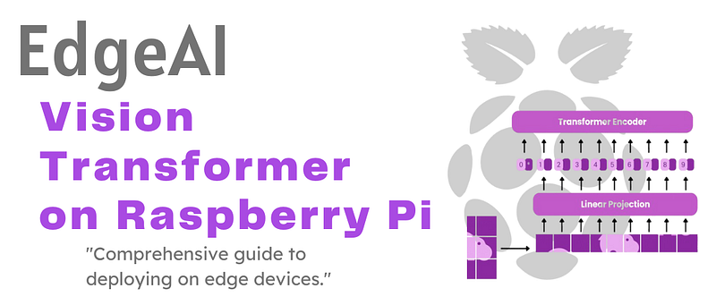
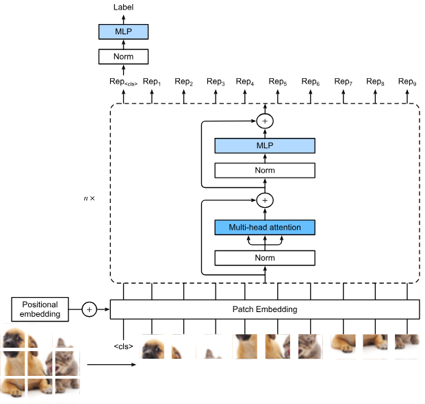

# EdgeAI - Vision Transformer on Raspberry Pi

_From mathematical foundations to edge implementation_

**Social media:**

👨🏽‍💻 Github: [thommaskevin/TinyML](https://github.com/thommaskevin/TinyML)

👷🏾 Linkedin: [Thommas Kevin](https://www.linkedin.com/in/thommas-kevin-ab9810166/)

📽 Youtube: [Thommas Kevin](https://www.youtube.com/channel/UC7uazGXaMIE6MNkHg4ll9oA)

:pencil2:CV Lattes CNPq: [Thommas Kevin Sales Flores](http://lattes.cnpq.br/0630479458408181)

👨🏻‍🏫 Research group: [Conecta.ai](https://conect2ai.dca.ufrn.br/)



## SUMMARY

1 - Introduction
 
2 - Mathematical Foundations

 2.1 - Self-Attention Mechanism
 
 2.2 - The Transition to Computer Vision
 
 2.3 - Core Components and Embeddings
 
 2.4 - The ViT Encoder Block
 
 2.5 - Training, Optimization, and Regularization
  
3 - EdgeAI Implementation

---

## 1 - Introduction

In recent years, Vision Transformers (ViTs) have emerged as a transformative architecture in the field of computer vision, fundamentally reshaping how visual information is processed and understood. Inspired by the success of the Transformer model in natural language processing, ViTs apply the self-attention mechanism to image data, enabling global contextual reasoning across spatial regions. Unlike traditional convolutional neural networks (CNNs), which rely on localized receptive fields and hierarchical feature extraction, Vision Transformers treat images as sequences of patches, allowing the model to capture long-range dependencies and complex visual relationships in a more flexible and scalable manner.


This paradigm shift has demonstrated state-of-the-art performance across various vision benchmarks, including image classification, object detection, and semantic segmentation. Moreover, it has bridged the methodological gap between visual and textual modalities by unifying the architecture of vision and language models. This unification has opened the path toward powerful multimodal systems capable of understanding and generating information across different domains. As research continues to improve their efficiency, interpretability, and adaptability for edge deployment, Vision Transformers are expected to remain a central element in the next generation of intelligent visual systems.


## 2 — Mathematical Foundations


The Vision Transformer (ViT) is a paradigm shift, adapting the Transformer architecture—originally developed for Natural Language Processing (NLP) to model sequences of words—to the domain of Computer Vision (CV), where the input is a 2D image.



The Transformer's power lies in the Self-Attention mechanism, which allows the model to weigh the importance of all other elements in the input sequence when processing a specific element.


### 2.1 — Self-Attention

The self-attention mechanism begins by projecting an input matrix of vectors, $\mathbf{Z} \in \mathbb{R}^{N \times D}$, into three distinct, lower-dimensional representation matrices: Query ($\mathbf{Q}$), Key ($\mathbf{K}$), and Value ($\mathbf{V}$). Here, $N$ is the sequence length (number of tokens/patches) and $D$ is the embedding dimension.


#### 2.1.1 —  Matrix Derivation

The projection is achieved via linear transformations using learned weight matrices $\mathbf{W}^Q, \mathbf{W}^K, \mathbf{W}^V \in \mathbb{R}^{D \times d_k}$, where $d_k$ is the dimension of the key and query vectors.$$\begin{aligned}
\mathbf{Q} &= \mathbf{Z} \mathbf{W}^Q, \quad \mathbf{Q} \in \mathbb{R}^{N \times d\_k} \\
\mathbf{K} &= \mathbf{Z} \mathbf{W}^K, \quad \mathbf{K} \in \mathbb{R}^{N \times d\_k} \\
\mathbf{V} &= \mathbf{Z} \mathbf{W}^V, \quad \mathbf{V} \in \mathbb{R}^{N \times d\_v}
\end{aligned}$$Note: In the original Transformer and ViT, typically $d_k = d_v$.


#### 2.1.2 —  The Scaled Dot-Product Attention Formula 

The attention score is calculated by the dot product of the Query with all Keys, followed by a scaling, a $\text{softmax}$ function to generate weights, and finally multiplication by the Value matrix.$$\text{Attention}(\mathbf{Q}, \mathbf{K}, \mathbf{V}) = \text{softmax}\left(\frac{\mathbf{Q}\mathbf{K}^T}{\sqrt{d_k}}\right)\mathbf{V}$$The term $\mathbf{A} = \text{softmax}\left(\frac{\mathbf{Q}\mathbf{K}^T}{\sqrt{d_k}}\right) \in \mathbb{R}^{N \times N}$ is the Attention Matrix, where $\mathbf{A}_{i, j}$ represents the attention weight that the $i$-th query gives to the $j$-th key/value.


#### 2.1.3 —  The Scaling Factor ($\sqrt{d_k}$) and Vanishing Gradients


The division by $\sqrt{d_k}$ is critical for training stability. For large values of $d_k$, the dot products in $\mathbf{Q}\mathbf{K}^T$ can grow very large in magnitude, especially as $N$ increases. When the input to the $\text{softmax}$ function is a large vector, the gradient of the $\text{softmax}$ becomes extremely small (saturates), leading to vanishing gradients. This makes learning slow or ineffective. The scaling factor mitigates this by normalizing the magnitude of the input to the $\text{softmax}$.


#### 2.1.4 —  Multi-Head Attention (MHA)

MHA is a mechanism that allows the model to jointly attend to information from different representation subspaces at different positions. It performs the single attention function $h$ times in parallel.

The input $\mathbf{Z}$ is split into $H$ heads, each with projections $\mathbf{W}_i^Q, \mathbf{W}_i^K, \mathbf{W}_i^V \in \mathbb{R}^{D \times d_{head}}$, where $d_{head} = D/H$.

$$
\text{MultiHead}(\mathbf{Q}, \mathbf{K}, \mathbf{V}) = \text{Concat}(\text{head}_1, \dots, \text{head}_H) \mathbf{W}^O
$$

$$\text{where } \text{head}_i = \text{Attention}(\mathbf{Z}\mathbf{W}_i^Q, \mathbf{Z}\mathbf{W}_i^K, \mathbf{Z}\mathbf{W}_i^V
$$

The concatenated output is finally projected with a learned weight matrix $\mathbf{W}^O \in \mathbb{R}^{H \cdot d_{head} \times D}$ back to the original dimension $D$. The justification is that each head learns to focus on different types of relationships (e.g., local versus global features in images), enriching the model's overall representational capacity.


### 2.2 — The Transition to Computer Vision


#### 2.2.1 —  Motivation for using Transformers in Images

Traditional Convolutional Neural Networks (CNNs) rely on a strong inductive bias for locality and translation invariance. While effective, this can limit their ability to model global dependencies (long-range relationships) across the image without deep, complex stacks of convolutional layers. The ViT addresses this by applying the global self-attention mechanism directly, treating the image as a sequence of patches, removing the need for local convolutions altogether.


#### 2.2.2 —  High-level Architectural Diagram of the ViT


The ViT architecture consists of three main stages:

- **Patch and Position Embedding:** The image is tokenized, embedded, and positional information is added.

-  **Transformer Encoder:** A sequence of identical blocks, each containing a Multi-Head Self-Attention (MSA) sub-layer and a Feed-Forward Network (FFN) sub-layer.

- **Classification Head:** A Multilayer Perceptron (MLP) head for final classification, which processes the output corresponding to the special classification token.


### 2.3 — Core Components and Embeddings


#### 2.3.1 —  Image Tokenization and Patch Embedding

The core innovation of ViT is converting a 2D image into a 1D sequence of "tokens" for the Transformer.

The input image $\mathbf{x} \in \mathbb{R}^{H \times W \times C}$ (Height, Width, Channels) is divided into a fixed number of non-overlapping patches $\mathbf{x}_p \in \mathbb{R}^{P \times P \times C}$, where $P$ is the patch size. The total number of patches is $N = (HW) / P^2$.

Each patch $\mathbf{x}_p$ is then flattened into a vector of dimension $P^2 \cdot C$. This flattened vector is linearly transformed (embedded) into a vector $\mathbf{x}_p^e \in \mathbb{R}^{D}$, where $D$ is the constant latent dimension used throughout the Transformer.

Transformation Formula and Dimensions:The patch embedding is:

$$
\mathbf{x}_p^e = \mathbf{x}_p \mathbf{E}, \quad \text{where } \mathbf{E} \in \mathbb{R}^{(P^2 \cdot C) \times D}
$$

Here, $\mathbf{x}_p \in \mathbb{R}^{P^2 \cdot C}$ (the flattened patch) is mapped to $\mathbf{x}_p^e \in \mathbb{R}^{D}$. The weight matrix $\mathbf{E}$ is the learned Patch Embedding matrix.


#### 2.3.2 —  Class Token ($\mathbf{CLS}$ Token) Integration


Similar to the $\mathbf{[CLS]}$ token in BERT for sentence classification, a learnable vector $\mathbf{x}_{\text{class}} \in \mathbb{R}^{D}$ is prepended to the sequence of patch embeddings.

The resulting matrix of embeddings $\mathbf{z}_0 \in \mathbb{R}^{(N+1) \times D}$ is:

$$
\mathbf{z}_0 = [\mathbf{x}_{\text{class}}; \mathbf{x}_1^e; \mathbf{x}_2^e; \dots; \mathbf{x}_N^e]
$$

The state of the $\mathbf{x}_{\text{class}}$ vector at the output of the final Transformer layer, $\mathbf{z}_L^0$, is used as the global image representation for the classification head.


#### 2.3.3 —  Positional Embeddings

Since the Transformer encoder has no inherent knowledge of the spatial arrangement of the patches, Positional Embeddings ($\mathbf{E}_{\text{pos}}$) must be explicitly added to the sequence embeddings $\mathbf{z}_0$.

The final input sequence $\mathbf{z}_0^{\text{final}}$ to the Transformer encoder is the element-wise sum:

$$
\mathbf{z}_0^{\text{final}} = \mathbf{z}_0 + \mathbf{E}_{\text{pos}}
$$

where $\mathbf{z}_0 \in \mathbb{R}^{(N+1) \times D}$ and $\mathbf{E}_{\text{pos}} \in \mathbb{R}^{(N+1) \times D}$. ViT uses a standard set of learnable 1D positional embeddings, where the position $i$ corresponds to the index of the patch in the flattened sequence.


### 2.4 — The ViT Encoder Block

The ViT Encoder is a sequence of $L$ identical layers. Each layer consists of two main sub-layers: a Multi-Head Attention (MSA) block and a Feed-Forward Network (FFN) block. Layer Normalization (LN) is applied before each sub-layer, and Residual Connections (Skip Connections) are applied after.


The output of layer $l$ ($\mathbf{z}_l$) is computed from the output of layer $l-1$ ($\mathbf{z}_{l-1}$) as:

$$
\mathbf{z}'_l = \text{MSA}(\text{LayerNorm}(\mathbf{z}_{l-1})) + \mathbf{z}_{l-1} \quad \text{(MSA Sub-layer with Residual)}
$$

$$
\mathbf{z}_l = \text{FFN}(\text{LayerNorm}(\mathbf{z}'_l)) + \mathbf{z}'_l \quad \text{(FFN Sub-layer with Residual)}
$$


#### 2.4.1 — Layer Normalization

Layer Normalization (LN) is applied across the feature dimension $D$ of the input $\mathbf{x} \in \mathbb{R}^{D}$ at each time step (i.e., for each patch token) independently, stabilizing the hidden state activations.


For an input vector $\mathbf{x}$ (a token/patch embedding), the normalized output $\hat{\mathbf{x}}$ is:

$$\hat{x}_i = \gamma \left(\frac{x_i - \mu}{\sqrt{\sigma^2 + \epsilon}}\right) + \beta
$$

where: 

- $x_i$ is the $i$-th element of the input vector $\mathbf{x}$.

- $\mu$ is the mean of the input vector: $\mu = \frac{1}{D} \sum_{j=1}^{D} x_j$.

- $\sigma^2$ is the variance of the input vector: $\sigma^2 = \frac{1}{D} \sum_{j=1}^{D} (x_j - \mu)^2$.

- $\epsilon$ is a small constant for numerical stability (typically $10^{-6}$).

- $\gamma \in \mathbb{R}^D$ and $\beta \in \mathbb{R}^D$ are learnable affine parameters that allow the network to restore the pre-normalization representation if necessary, making the transformation an identity function in the ideal case, while still retaining the benefits of normalization.


#### 2.4.2 — Pre-norm vs. Post-norm

The ViT typically uses Pre-norm (LayerNorm applied before MSA and FFN), as shown in the equations above. This configuration, popularized after the original Transformer paper, is generally found to be more stable for very deep transformers, as it ensures that the inputs to the sub-layers have a controlled variance, promoting better gradient flow. Post-norm (LayerNorm applied after the residual addition) can lead to early-stage training instability, requiring warm-up and smaller learning rates.


#### 2.4.3 — Residual Connections (Skip Connections)


The skip connection, adding the sub-layer input $\mathbf{z}_{l-1}$ (or $\mathbf{z}'_l$) to the sub-layer output, is essential. Mathematically, the sub-layer output is $\mathbf{y} = \text{Sublayer}(\mathbf{x}) + \mathbf{x}$. This structure ensures a direct path for the gradient to flow through the network, largely mitigating the vanishing gradient problem in deep architectures.


### 2.5 — Training, Optimization, and Regularization


#### 2.5.1 — Loss Function: Cross-Entropy for Classification

For a multi-class classification task, the model output $\mathbf{y} \in \mathbb{R}^K$ (where $K$ is the number of classes) is typically the result of a linear layer applied to the $\mathbf{CLS}$ token output. This is passed through a $\text{softmax}$ function to yield a predicted probability distribution $\hat{\mathbf{p}}$ over the classes.

For a single sample with true one-hot label $\mathbf{p} \in \{0, 1\}^K$, the Categorical Cross-Entropy Loss ($\mathcal{L}_{CE}$) is:

$$
\mathcal{L}_{CE}(\mathbf{p}, \hat{\mathbf{p}}) = - \sum_{k=1}^K p_k \log(\hat{p}_k)
$$

In practice, for classification, if the true class is $c$, $p_c=1$ and $p_{k \neq c}=0$, so the formula simplifies to:$$\mathcal{L}_{CE} = - \log(\hat{p}_c)$$The goal is to minimize this loss, maximizing the log-probability of the correct class.


#### 2.5.2 — Regularization Strategies


Dropout is a regularization technique where, during training, each element of the output of a layer (e.g., in the FFN) is set to zero with probability $p$.

Mathematically, if $\mathbf{x}$ is the output of a layer, the dropout operation is:

$$
\mathbf{y} = \mathbf{m} \odot \mathbf{x} \cdot \frac{1}{1-p}
$$

where $\mathbf{m}$ is a mask vector sampled from a Bernoulli distribution ($\mathbf{m}_i \sim \text{Bernoulli}(1-p)$), and $\odot$ is the Hadamard product (element-wise multiplication). The division by $1-p$ is a scaling factor applied at training time to ensure that the expected output of the layer remains the same as without dropout: $E[\mathbf{y}] = \mathbf{x}$.

Its mathematical interpretation is a form of sparse approximation, preventing the co-adaptation of features by ensuring that no single neuron is overly reliant on any other specific neuron's output.


#### 2.5.3 — Optimizers: AdamW

AdamW (Adam with Weight Decay) is the preferred optimizer for ViT and other large Transformer models. It is an extension of the Adam optimizer that correctly implements the L2 regularization term (weight decay).

#### 2.5.4 — Decoupling of Weight Decay

In traditional Adam with L2 regularization ($\lambda$):

$$
\text{Gradient} = \nabla_{\theta} \mathcal{L} + \lambda \theta
$$

The regularization term is included in the gradient, meaning it is also scaled by the adaptive learning rate factor $\eta \cdot (\frac{\hat{m}_t}{\sqrt{\hat{v}_t} + \epsilon})$.

In AdamW, the L2 regularization (weight decay) is decoupled from the gradient computation and applied as a separate update step, which is a key to its stability and improved generalization for Transformers.

The update rule for a parameter $\theta_t$ at time step $t$ is:

$$
\theta_t = \theta_{t-1} - \eta \cdot \left(\frac{\hat{m}_t}{\sqrt{\hat{v}_t} + \epsilon}\right) - \eta \lambda \theta_{t-1}
$$

The first term is the standard Adam update, and the second term, $-\eta \lambda \theta_{t-1}$, is the pure weight decay step applied directly to the parameters, which ensures that the regularization is consistent across all parameters regardless of their adaptive learning rates.


#### 2.5.5 — Large-Scale Training & Fine-Tuning

ViT models are notoriously data-hungry due to their low inductive bias for image structure. Therefore, they are almost universally trained first via Transfer Learning (Pre-training) on massive datasets (e.g., ImageNet-21k, JFT-300M).

After pre-training, the model is adapted to a smaller, downstream task via Fine-Tuning (Ajuste Fino). This involves replacing the pre-training classification head with a task-specific head and training the entire network, or just the new head, on the target dataset with a much smaller learning rate.


#### 2.5.6 — Post-Training Analysis: Mathematical Interpretation of Attention Maps


The internal workings of ViT can be interpreted using the final attention matrix $\mathbf{A} \in \mathbb{R}^{(N+1) \times (N+1)}$ from the last attention sub-layer. The output $\mathbf{V}_{\text{out}}$ of the attention block is a weighted sum of the Value vectors:

$$
\mathbf{V}_{\text{out}} = \mathbf{A} \mathbf{V}
$$

The rows of the attention matrix $\mathbf{A}$ represent the Attention Maps $\mathbf{a}_i$. Specifically, $\mathbf{a}_{i} \in \mathbb{R}^{1 \times (N+1)}$ shows how much the $i$-th query token attends to every other patch (Key) in the sequence.

The most crucial attention map is the one corresponding to the $\mathbf{CLS}$ token ($\mathbf{a}_{\text{cls}}$), as its output vector $\mathbf{z}_{\text{cls}} = \mathbf{a}_{\text{cls}} \mathbf{V}_{\text{out}}$ is used for the final prediction. Visualizing this attention map (e.g., mapping the weights $\mathbf{a}_{\text{cls}, j}$ back onto the image patch locations) reveals which parts of the image the model deemed most important for its final classification decision.


## 3 - EdgeAI Implementation

With this example you can implement the machine learning algorithm in Raspberry Pi.


### 3.0 - Gather the necessary materials

- Raspberry Pi 5 with 16Gb (with a compatible power cable)

- MicroSD card (minimum 64 GB, 126 GB or higher recommended)

- Computer with an SD card reader or USB adapter

- HDMI cable and a monitor/TV

- USB keyboard and mouse (or Bluetooth if supported)

- Internet connection (via Wi-Fi or Ethernet cable)


### 3.1 - Download and install the operating system


Visit [here](https://medium.com/@thommaskevin/edgeai-llama-on-raspberry-pi-4-4dffd65d33ab) to do how download and install the operating system in Raspberry pi 4 or 5.


### 3.2 - Update the system

```bash
sudo apt update && sudo apt upgrade -y
```

### 3.3 - Creat and Active a Virtual Environment

```bash
python3 -m venv ~/ragvenv
source ~/ragvenv/bin/activate
```

### 3.4 - Install Requirements

```bash
pip install -r requirements.txt
```

### 3.5 - ViT Implementation

-  [](https://github.com/thommaskevin/EdgeAI/blob/main/10_ViT/code/ViT_from_scratch.ipynb) Vision Transformer From Scratch Implementation (step-by-step).


Copy the code in below and save as vit_backend.py:

-  [](https://github.com/thommaskevin/EdgeAI/blob/main/10_ViT/code/vit_backend.py)  Vision Transformer backend.

Copy the code in below and save as vit_frontend.py:

-  [](https://github.com/thommaskevin/EdgeAI/blob/main/10_ViT/code/vit_frontend.py)  Vision Transformer user interface.


### 3.6 - Run the application

create a folder with the name of the project and place the files  "vit_backend.py" and "vit_frontend.py" in this folder. Navigate to this folder from the prompt (with ragvenv still active) and run:

```bash
streamlit run vit_frontend.py
```


### 3.7 - Result


