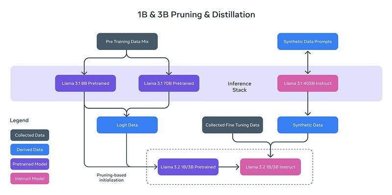

# EdgeAI - Llama on Raspberry Pi 4

_From mathematical foundations to edge implementation_

**Social media:**

👨🏽‍💻 Github: [thommaskevin/TinyML](https://github.com/thommaskevin/TinyML)

👷🏾 Linkedin: [Thommas Kevin](https://www.linkedin.com/in/thommas-kevin-ab9810166/)

📽 Youtube: [Thommas Kevin](https://www.youtube.com/channel/UC7uazGXaMIE6MNkHg4ll9oA)

:pencil2:CV Lattes CNPq: [Thommas Kevin Sales Flores](http://lattes.cnpq.br/0630479458408181)

👨🏻‍🏫 Research group: [Conecta.ai](https://conect2ai.dca.ufrn.br/)


## SUMMARY

1 — Introduction

2 — Overview of Ollama

2.1 — Conversation Processing Flow

2.2 — Architecture of Ollama

3 — EdgeAI Implementation

---

## 1 - Introduction

arge Language Models (LLMs) have revolutionized the field of artificial intelligence, offering unprecedented capabilities in natural language understanding, generation, and interaction. These models, powered by advanced deep learning techniques such as the Transformer architecture, have found applications across a wide range of domains, from customer support and content creation to software development and education. However, the growing complexity of these models has also introduced significant challenges in accessibility, scalability, and customization, particularly for individuals and organizations without extensive technical expertise or computational resources.
Ollama emerges as a transformative platform within this context, designed to simplify and enhance the deployment and utilization of LLMs. Positioned as a bridge between cutting-edge AI models and practical applications, Ollama provides a user-friendly environment for interacting with LLMs while addressing key barriers such as cost, usability, and adaptability. By integrating features like task-specific fine-tuning, secure data handling, and seamless API integration, Ollama caters to a diverse audience - from businesses seeking automation solutions to researchers experimenting with natural language processing.

## 2 - Overview of Ollama

Ollama is an advanced platform designed to simplify the interaction and deployment of Large Language Models (LLMs). It provides an intuitive interface that enables users to seamlessly integrate LLM capabilities into various workflows without requiring deep technical expertise. Developed by a team focused on democratizing access to AI, Ollama bridges the gap between complex LLM technologies and practical applications across industries. While specific details about the developers or origin may vary, Ollama's mission aligns with empowering businesses, researchers, and creators to harness LLMs effectively.


The primary purpose of Ollama is to make LLMs more accessible and applicable by addressing common challenges such as usability, customizability, and scalability. As industries increasingly rely on AI for automation, data analysis, and decision-making, tools like Ollama ensure that even organizations with limited AI expertise can deploy sophisticated language models. By offering an approachable platform, Ollama reduces barriers related to cost, technical knowledge, and integration, enabling users to focus on leveraging AI for their specific goals.

**1. User-Friendly Interface for Interacting with LLMs** 

Ollama is designed with simplicity in mind, providing a streamlined interface that minimizes the complexity of working with LLMs. This allows non-technical users to access the power of language models for tasks such as text generation, summarization, and conversational AI without requiring extensive coding or AI expertise.

**2. Customizability for Specific Tasks or Industries**

One of Ollama's standout features is its flexibility. Users can customize language models to suit their specific needs, whether it's fine-tuning for domain-specific language, adapting the model for niche industries, or optimizing workflows for specialized applications. This adaptability makes Ollama valuable across diverse sectors, including healthcare, education, and e-commerce.

**3. Support for Multilingual Capabilities or Specific Frameworks**

With growing global demand for multilingual AI solutions, Ollama supports language diversity, enabling users to deploy models capable of understanding and generating content in multiple languages. Additionally, it offers compatibility with industry-specific frameworks, making it easier to integrate into existing ecosystems.

Ollama differentiates itself from other platforms like OpenAI API and Hugging Face by focusing on user accessibility and customizability:

- OpenAI API: While OpenAI provides access to powerful models like GPT-4, it often requires technical expertise for effective integration. Ollama simplifies this process with its intuitive design and pre-configured workflows.

- Hugging Face: Hugging Face offers a vast library of pre-trained models and tools for customization but can be overwhelming for users without coding knowledge. Ollama bridges this gap by combining ease of use with robust functionality.

- Other Tools: Unlike many competitors that focus on technical flexibility for developers, Ollama prioritizes usability for a broader audience, including non-technical professionals and small businesses.

### 2.1 - Conversation Processing Flow

The conversation process between the user and Ollama can be broken down as follows:


1. The user initiates a conversation by executing the CLI command ollama run llama3.2 (where llama3.2 is an open-source large language model, though other LLMs can also be used).

2. Preparation stage:

- The CLI client sends an HTTP request to ollama-http-server to retrieve model information. The server attempts to read the local manifests metadata file; if it doesn't exist, a 404 not found error is returned.

- If the model is not found, the CLI client sends a request to ollama-http-server to pull the model, and the server downloads it from the remote repository to the local machine.

- The CLI client requests the model information again.

3. Interactive conversation stage:

- The CLI first sends an empty message to the /api/generate endpoint on ollama-http-server, and the server performs some internal channel handling (in Go, channels are used).

- If the model information contains messages, they are printed. Users can create a new model based on the current model and session history, and the conversation history will be saved as messages.

- The formal conversation begins: The CLI sends a request to the /api/chat endpoint on ollama-http-server. The ollama-http-server relies on the llama.cpp engine to load the model and perform inference (since llama.cpp also serves as an HTTP server). At this point, ollama-http-server first sends a /health request to llama.cpp to confirm its health status, then sends a /completion request to receive the conversation response, which is ultimately returned to the CLI for display.


### 2.2 - Architecture of Ollama


The architecture of Ollama is designed to provide a seamless interface between users and Large Language Models (LLMs), enabling efficient deployment, interaction, and customization. Its design balances usability with technical sophistication, ensuring that users can access cutting-edge AI capabilities without requiring extensive expertise.


Ollama employs a classic Client-Server (CS) architecture, where:

- The Client interacts with the user via the command line.

- The Server can be started through one of several methods: command line, desktop application (based on the Electron framework), or Docker. Regardless of the method, they all invoke the same executable file.

- The Client and Server communicate using HTTP.

The Ollama Server consists of two core components:

- ollama-http-server: Responsible for interacting with the client.

- llama.cpp: Serving as the LLM inference engine, it loads and runs large language models, handling inference requests and returning results.

- Communication between ollama-http-server and llama.cpp also occurs via HTTP.

Below, we outline the core components and workflow of Ollama's architecture:


#### 2.2.1 - Backend Infrastructure

- Ollama's backend is built to support the hosting of multiple LLMs, including popular pre-trained models (e.g., GPT, LLaMA, or custom models). These models are optimized for scalability, allowing real-time inference and efficient resource utilization.

- Use of distributed systems to handle large-scale computations and simultaneous user requests.

- Containerized deployment environments (e.g., Docker/Kubernetes) for modularity and portability.

#### 2.2.2 - Fine-Tuning Framework

Ollama integrates a fine-tuning pipeline that enables users to adapt models to their specific needs. This may involve:

- Transfer learning using domain-specific datasets.

- Hyperparameter optimization for improved model performance.

- Storage and retrieval of fine-tuned models for reuse.


#### 2.2.3 - Data Processing Pipeline:

A preprocessing layer ensures that user inputs are cleaned, tokenized, and transformed into model-compatible formats. Postprocessing ensures outputs are formatted for readability and usability.

**Frontend Interface**

A web-based or desktop application provides users with an intuitive interface for interacting with models. The frontend communicates with the backend through APIs, offering functionalities like:

- Real-time text generation and analysis.
- Drag-and-drop tools for uploading custom datasets.
- Interactive dashboards for monitoring and managing tasks.

**API Layer**

Ollama includes a RESTful or GraphQL API that allows developers to programmatically interact with LLMs. This API supports:
- Sending queries and receiving model responses.

- Uploading training data for fine-tuning.

- Integrating Ollama's capabilities into third-party applications or workflows.

**Multilingual and Framework Support**

Leveraging tokenization strategies like Byte Pair Encoding (BPE) or SentencePiece, Ollama supports multiple languages.
Framework compatibility allows integration with popular machine learning environments such as TensorFlow, PyTorch, and ONNX.

**Data Privacy and Security Layer**

Ollama incorporates advanced encryption methods to ensure the privacy and security of user data. This includes:
Secure Socket Layer (SSL) encryption for data in transit.
End-to-end encryption for sensitive queries and results.
Role-based access controls (RBAC) for managing user permissions.


#### 2.2.4 - Workflow


- User Interaction: Users interact with the system through the web/desktop interface or API, submitting tasks such as text generation, classification, or fine-tuning.

- Task Processing: The request is passed through the data preprocessing pipeline, where it is prepared for inference or training. If the task involves fine-tuning, the system retrieves relevant training data and initiates the fine-tuning pipeline.

- Model Execution: LLMs process the request in the backend, leveraging GPU/TPU accelerators for high-speed computation. Results are passed through the postprocessing layer for formatting and optimization.

- Response Delivery: Processed outputs are sent back to the frontend or API, where users can access results in real time.


#### 2.2.5 - Innovations in Ollama's Architecture

- Adaptive Model Loading: Ollama dynamically loads and unloads models based on user demand, optimizing resource usage while minimizing latency.

- On-Device Inference (Optional): For users prioritizing data privacy, Ollama supports running smaller, fine-tuned models locally on edge devices, reducing dependency on cloud infrastructure.

- Federated Learning Integration: Ollama allows for federated learning setups, enabling organizations to train models collaboratively without sharing sensitive data.

- Scalability: By using auto-scaling cloud infrastructure, Ollama can handle varying workloads, from small-scale experimentation to enterprise-grade deployments.

The Meta Llama 3.2 series comprises a collection of multilingual large language models (LLMs) tailored for text generation and interpretation. Available in two sizes - 1B and 3B parameters - these models are both pre-trained and fine-tuned for instruction-based tasks. They excel in multilingual dialogue use cases, such as information retrieval and text summarization.





Both the 1B and 3B models originate from the larger Llama 8B model. During training, token-level distillation was applied, leveraging logits from the 8B and 70B models as reference targets. This technique, combined with knowledge distillation, enabled high-performance recovery while training on a vast dataset containing 9 trillion tokens.


The 1B model consists of 1.24 billion parameters, quantized using an integer format (Q8_0), while the 3B model includes 3.12 billion parameters, employing Q4_0 quantization. These optimizations yield compact model sizes of 1.3 GB and 2 GB, respectively. Both models also feature an impressive context window of 131,072 tokens, making them highly capable of processing lengthy text inputs.


## 3 - EdgeAI Implementation

With this example you can implement the machine learning algorithm in Raspberry Pi 4.

### 3.0 - Gather the necessary materials

- Raspberry Pi 4 (with a compatible power cable)

- MicroSD card (minimum 8 GB, 16 GB or higher recommended)

- Computer with an SD card reader or USB adapter

- HDMI cable and a monitor/TV

- USB keyboard and mouse (or Bluetooth if supported)

- Internet connection (via Wi-Fi or Ethernet cable)


### 3.1 - Download the operating system

- Option 1: Raspberry Pi OS (Recommended)
Download the official Raspberry Pi Imager tool: [Raspberry Pi OS - Raspberry Pi](https://www.raspberrypi.com/software/)


- Execute the imager.exe


- Choose Device


- Choose OS: Raspberry Pi OS (64-bit)


- Connect the microSD in the computer and choose the storage


- Click in next and No.


- And Click yes:


- Wait the Writing:


### 3.2 - Set up the Raspberry Pi

- Insert the microSD card into the Raspberry Pi.

- Connect the monitor, keyboard, mouse, and power cable.

- The Raspberry Pi will boot automatically. Follow the on-screen setup to: Select language and time zone, Connect to the internet and Update the system.


### 3.3 - Update the system

Open the terminal and write:

```bash
sudo apt update && sudo apt upgrade -y
```


### 3.4 - Update the system

Let's set up and activate a Virtual Environment for working with Ollama:


```bash
python3 -m venv ~/wenv
source ~/wenv/bin/activate
```

And run the command to install Ollama:


```bash
curl -fsSL https://ollama.com/install.sh | sh
```


Verify the Ollama version, which will also tell us that it is correctly installed:

```bash
ollama -v
```


### 3.5 - Run llama

The question: Explain llama (the animal)

```bash
ollama run llama3.2:1b
```


